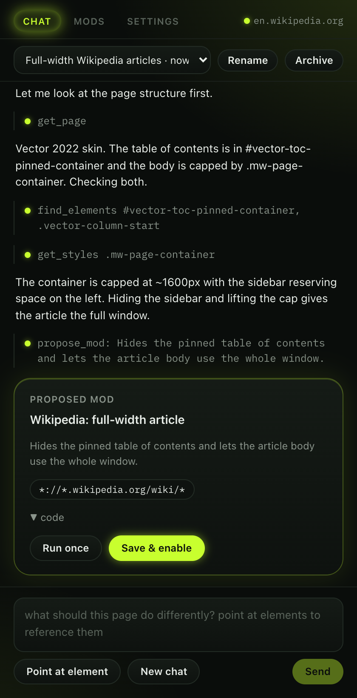

# usermods

**Vibe-code userscripts in place.** An open-source browser extension that lets you customize any website by chatting with the LLM of your choice.

Open the side panel on any page, describe what you want changed, and usermods inspects the page, writes a userscript, tests it live, and hands it to you with *Try* and *Save* buttons. Saved mods run automatically on every matching page load. Export them as standard `.user.js` files, install ones from Greasy Fork, or [migrate your whole Tampermonkey library in one file](#migrating-from-tampermonkey).

Userscripts, userstyles, usermods.

<p align="center">
  
</p>

## Why

- **Any backend.** Anthropic's API, OpenAI, OpenRouter, or anything OpenAI-compatible: Ollama, LM Studio, vLLM, mlx_lm. Your key, your machine, no account, no hosted service.
- **The model actually sees the page.** It has tools to read a pruned DOM, list elements, read computed styles, take screenshots, and run scripts to test its work before proposing anything.
- **One-off tasks too.** "Scroll to the bottom, open every carousel, and give me download links for all the photos" runs as a script, no mod required.
- **Portable.** Mods are plain userscripts with a `==UserScript==` header. Nothing proprietary.
- **MIT.**

## Status

Early. The core loop works end to end: chat, page inspection, live testing, propose, save, run on load, import and export. Outside userscripts install from a URL, a `.user.js` link or a file, with the `GM_*` API and `@require`/`@resource` support they expect, and a Tampermonkey backup imports in one step. See [Roadmap](#roadmap).

## Screenshots

<table>
  <tr>
    <td width="50%" valign="top">
      
      <sub><b>Dark mode.</b> The panel follows the browser's color scheme.</sub>
    </td>
    <td width="50%" valign="top">
      
      <sub><b>Point at an element.</b> Clicking one on the page drops an <code>@reference</code> into your message, so you can say "this" and mean it.</sub>
    </td>
  </tr>
  <tr>
    <td width="50%" valign="top">
      
      <sub><b>Mods.</b> Saved scripts, split by whether they match the page you are on. Toggle, run, export or delete each one.</sub>
    </td>
    <td width="50%" valign="top">
      
      <sub><b>Settings.</b> Presets for the common backends, and a sign-in card for the two subscriptions that work without an API key.</sub>
    </td>
  </tr>
  <tr>
    <td width="50%" valign="top">
      
      <sub><b>Installing an outside script.</b> A <code>.user.js</code> link shows what it matches, what it is granted and what it loads, before anything is saved.</sub>
    </td>
    <td width="50%" valign="top">
      
      <sub><b>Migrating.</b> One Tampermonkey backup file brings the whole library across, on/off state and stored values included.</sub>
    </td>
  </tr>
</table>

## Install (from source)

Requires Node 22+ and Chrome 135+.

```sh
npm install
npm run build
```

Then in Chrome:

1. Open `chrome://extensions`, turn on **Developer mode**, click **Load unpacked**, and pick `.output/chrome-mv3`.
2. Click **Details** on usermods and turn on **Allow User Scripts**. Chrome requires this toggle for any extension that runs user scripts, including Tampermonkey.
3. Click the usermods icon to open the side panel. Go to **Settings**, pick a provider, paste a key (or a local server URL), and save.

For development, `npm run dev` starts WXT with hot reload and opens a Chrome profile with the extension loaded. `npm run typecheck` type-checks, and `npm test` runs the header/backup parser tests (Node's built-in runner, no browser needed).

`npm run screenshots` regenerates the images above, and `npm run smoke` runs the same flow headless as an end-to-end check of the chat loop. Both build the extension, load it into Playwright's Chromium, and drive the real side panel against `scripts/mock-llm.mjs` — a local server that plays scripted conversations over the OpenAI wire protocol, so neither needs an API key or a live model. The page-inspection tools run for real against live pages, and the smoke run asserts that the reply streams, that `get_page`, `find_elements` and `get_styles` all succeed, that the proposal card appears with the expected name and match pattern, and that saving it writes a userscript to storage. See the comments at the top of `scripts/screenshots.mjs` for how the side panel is driven without a real side panel.

## Providers

Two wire protocols, any endpoint:

| Preset | Protocol | Base URL |
|---|---|---|
| Anthropic | Anthropic Messages | `https://api.anthropic.com` |
| OpenAI | OpenAI chat completions | `https://api.openai.com/v1` |
| xAI Grok | OpenAI chat completions | `https://api.x.ai/v1` |
| OpenRouter | OpenAI chat completions | `https://openrouter.ai/api/v1` |
| Ollama, LM Studio, vLLM, mlx_lm | OpenAI chat completions | your local server |
| Custom | either | anything you type |

The base URL is always editable. Anything that speaks one of the two protocols will work, so a self-hosted gateway, a corporate proxy, or a model router all drop in.

### Using a subscription instead of an API key

Two subscriptions can sign in directly from Settings, with no API key and no local process:

| Preset | Plans | How |
|---|---|---|
| ChatGPT subscription | Plus, Pro, Team | "Sign in with ChatGPT" device code. Opens a page, you type a short code, done. |
| SuperGrok subscription | SuperGrok, or X Premium+ on the X account you sign in with | xAI's coding-agent OAuth, same device-code flow. |

Both talk to the vendor's Responses API backend that their own coding agents use. Tokens are stored in extension local storage and refreshed automatically. Use **Fetch models** after signing in to see which model ids your plan allows.

Caveats worth knowing:

- Neither vendor publishes developer docs for this. The endpoints and headers are the ones their CLIs use, as reused by several open-source agents. OpenAI and xAI have both said third-party tools may use these logins, but that is a statement, not a contract.
- Usage counts against your plan's limits.
- xAI has been seen to reject some standard-tier SuperGrok accounts with a 403 even when the subscription is active.
- Anthropic forbids using a Claude subscription outside its own clients, so there is no Claude sign-in. Anthropic's sanctioned route is the Agent SDK credit, which requires the Claude Code CLI on your machine. If you run a local proxy built on that, point a Custom Anthropic preset at it.

For any other subscription, the same rule applies: run a local proxy that exposes it as an Anthropic- or OpenAI-compatible endpoint and point a Custom preset at it.

## Importing scripts and migrating from Tampermonkey

usermods runs ordinary userscripts, so you can bring in scripts from Greasy Fork, OpenUserJS or your own collection.

**Install from a URL.** Paste a `.user.js` URL into *Install from URL* in the Mods tab and click **Fetch**. You get a preview — name, version, what it matches, which `GM_*` permissions it asks for, the libraries it loads, and the full source — before anything is saved.

**Click a `.user.js` link.** usermods redirects `.user.js` navigations to its own install page, the way Tampermonkey does, so clicking an install link on Greasy Fork shows the same preview instead of a wall of raw JavaScript.

**Import a file.** *Import file* in the Mods tab takes a `.user.js` file from disk through the same preview.

`@require` libraries and `@resource` files are downloaded at install time and stored with the mod, because registered scripts cannot fetch them later. If one of those downloads fails, the install fails and names the URL. Scripts with a `@downloadURL` get an **Update** button that refetches and compares `@version`.

### Migrating from Tampermonkey

Chrome extensions cannot read each other's storage, so migration goes through Tampermonkey's own export file:

1. Open the Tampermonkey dashboard (its toolbar icon → **Dashboard**).
2. Go to the **Utilities** tab.
3. Under **File**, click **Export** to save the backup (`.zip` or `.json`).
4. In usermods, open the **Mods** tab, expand **Migrate from Tampermonkey**, and pick that file.

Both export shapes work: the JSON document (an object with a `scripts` array) and the ZIP (one `.user.js` per script plus its `.options.json` and `.storage.json` sidecars, or the older JSON-in-`.txt` entries). Each script comes across with its enabled/disabled state, its `GM_setValue` store and its update URL. Scripts already installed at the same name and version are skipped, and the import reports how many came in and what it passed over.

### GM API compatibility

| Function | Status |
|---|---|
| `GM_info` / `GM.info` | Supported |
| `GM_addStyle`, `GM_addElement` | Supported |
| `GM_getValue`, `GM_setValue`, `GM_deleteValue`, `GM_listValues` (and `GM.*`) | Supported. Reads come from a snapshot taken when the script was registered; writes persist immediately and are pushed live to the script's other open tabs. |
| `GM_getResourceText`, `GM_getResourceURL` | Supported, from `@resource` files fetched at install time |
| `GM_xmlhttpRequest` / `GM.xmlHttpRequest` | Supported, cross-origin, via the background worker, subject to `@connect`. `responseType` `arraybuffer`, `blob`, `json`, `document` and text all work, with `responseXML` for `document`. `onload`, `onerror`, `onloadend` and `abort()` work; streaming and upload progress events do not. |
| `GM_openInTab` / `GM.openInTab` | Supported, with Tampermonkey's focus rules: `GM_openInTab(url)` opens in the foreground, `GM_openInTab(url, true)` and the object form without `active: true` open in the background. The returned handle is a stub: `close()` does nothing. |
| `GM_setClipboard`, `GM_log` | Supported |
| `GM_registerMenuCommand`, `GM_unregisterMenuCommand` | **Stub.** Commands are recorded but there is no menu UI to invoke them. |
| `GM_notification` / `GM.notification` | **Stub.** Logs to the console instead of showing a desktop notification. |
| `GM_getTab`, `GM_saveTab`, `GM_getTabs` | **Stub.** Return empty objects. |
| `GM_addValueChangeListener`, `GM_removeValueChangeListener` | Supported. Fire for this script's own writes and for writes from its other open tabs, with `(key, oldValue, newValue, remote)`. In the page world (`@grant none`) only local writes fire. |
| `GM_download`, `GM_cookie`, `GM_webRequest` | Not implemented |

`@connect` is enforced for `GM_xmlhttpRequest`: a request is allowed when its host equals or is a subdomain of a `@connect` entry, when the script declares `@connect *`, or when the host is one the script already matches (`@connect self`). Anything else is rejected with an error naming the host and the `// @connect` line to add. The install preview lists what a script declares.

Scripts and their `@require` libraries are evaluated in their own function scopes, not in one shared strict-mode closure, so sloppy-mode libraries and scripts behave as they do under Tampermonkey. A script gets strict mode only from its own `'use strict'` directive.

`@grant none` and `unsafeWindow` scripts run in the page's **MAIN** world, where they share globals with the page — which is what those scripts want. The trade-off is that extension messaging is unavailable there, so `GM_setValue` writes from a MAIN-world script update the in-page copy but **cannot be persisted**. Mod cards and the install preview mark those scripts with a *page world* badge. Everything else runs in Chrome's isolated `USER_SCRIPT` world.

Regex-style `@include` lines (`/^https?:\/\/…$/`) are not supported; Chrome matches on patterns and globs only. The install preview warns when it drops one.

## How it works

```
side panel (React)  ──rpc──▶  background service worker  ──▶  LLM provider (streaming, tool calls)
        │                             │
        │                             ├──▶ content script: DOM snapshot, element picker, selectors, styles
        │                             ├──▶ chrome.userScripts.execute: run a draft once, capture result + console
        │                             └──▶ chrome.userScripts.register: saved mods run on matching pages
        └── Try / Save / Enable
```

- **Provider adapters** live in `lib/providers/`. Anthropic uses the official SDK; the OpenAI-compatible adapter speaks `chat/completions` with function calling over raw fetch. Adding a provider means implementing one `chat()` method.
- **The agent loop** (`lib/agent/`) is provider-neutral. Tools: `get_page`, `find_elements`, `get_styles`, `run_script`, `screenshot`, `propose_mod`.
- **Mods** are stored in `chrome.storage.local` as full userscript text. The header is parsed for name, description, `@match`/`@include`/`@exclude`, `@grant`, `@require`, `@resource`, `@run-at` and `@noframes`. Enabled mods are registered with `chrome.userScripts`, each wrapped in a closure that provides the `GM_*` and `GM.*` API, in the world and at the run-at its header asks for.
- **Chat history** is kept per tab in `chrome.storage.session`, so it survives the service worker sleeping but not a browser restart.

## Security notes

- Page content that the model reads is untrusted. The system prompt tells the model to treat it as data, and every generated script is shown to you before it is saved. Read it.
- Scripts run in an isolated world: they see the DOM but not the page's JavaScript globals. Default `@match` is the current site only.
- Your API key is stored in extension local storage and sent only to the endpoint you configure.

## Roadmap

- Agent mode with proper click, type and scroll tools plus screenshot-driven verification, for tasks the DOM-script approach handles poorly.
- Edit an existing mod from chat ("make the button blue instead").
- Mod sharing: export is there; a gallery is not.
- CSS-only mods via a `@usermods-style` header, so pure restyles need no JavaScript.
- Firefox, once its side panel story is settled.

## Author

Made by [Kenneth Ballenegger](https://github.com/kballenegger).

## License

MIT © Kenneth Ballenegger
