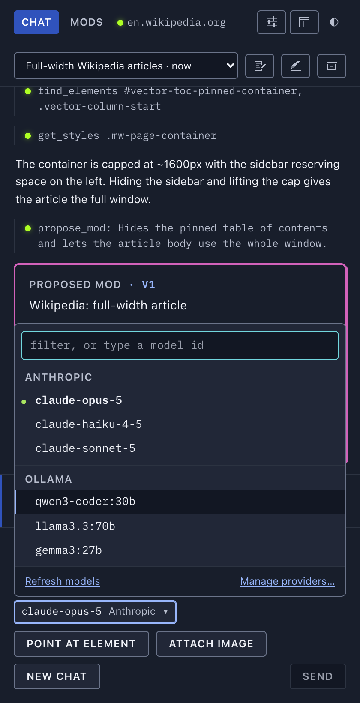

<p align="center"></p>

# usermods

**Vibe-code userscripts in place.** An open-source browser extension that lets you customize any website by chatting with the LLM of your choice.

Open the side panel on any page, describe what you want changed, and usermods inspects the page, writes a userscript, tests it live, and hands it to you with *Try* and *Save* buttons. Saved mods run automatically on every matching page load. Export them as standard `.user.js` files, install ones from Greasy Fork, or [migrate your whole Tampermonkey library in one file](docs/guide.md#migrating-from-tampermonkey).

Userscripts, userstyles, usermods.

https://github.com/user-attachments/assets/b2102d80-e0ff-447f-a1c9-9c62583c4786

<p align="center"></p>

## Why

- **Any backend.** Anthropic's API, OpenAI, OpenRouter, or anything OpenAI-compatible: Ollama, LM Studio, vLLM, mlx_lm. Your key, your machine, no account, no hosted service.
- **Use the subscription you already pay for.** Sign in with ChatGPT (Plus, Pro, Team) or SuperGrok / X Premium+ straight from Settings. No API key, no local proxy, no per-token bill.
- **The model actually sees the page.** It reads a pruned DOM, lists elements, reads computed styles, takes screenshots, and runs scripts to test its work before proposing anything.
- **One-off tasks too.** "Scroll to the bottom, open every carousel, and give me download links for all the photos" runs as a script, no mod required.
- **Portable.** Mods are plain userscripts with a `==UserScript==` header. Nothing proprietary. **MIT.**

## Status

Early, and working end to end: chat, page inspection, live testing, propose, save, run on load, edit an installed mod in chat, import and export. v0.1.0 is submitted to the Chrome Web Store and pending review; the Safari build runs on Mac, iPhone and iPad. See [Roadmap](docs/roadmap.md).

## Screenshots

<table>
  <tr>
    <td width="50%" valign="top">
      
      <sub><b>Point at an element.</b> <b>+</b> → <i>Point at element</i>, then click one on the page: an <code>@reference</code> drops into your message, so you can say "this" and mean it.</sub>
    </td>
    <td width="50%" valign="top">
      
      <sub><b>Pick the model in the chat.</b> One chip holds every connected provider's models and the Thinking level. Change it mid-conversation and the next turn goes to the new one.</sub>
    </td>
  </tr>
  <tr>
    <td width="50%" valign="top">
      
      <sub><b>Mods.</b> Saved scripts, split by whether they match the page you are on. Toggle, run, export or delete each one.</sub>
    </td>
    <td width="50%" valign="top">
      
      <sub><b>Installing an outside script.</b> A <code>.user.js</code> link shows what it matches, what it is granted and what it loads, before anything is saved.</sub>
    </td>
  </tr>
  <tr>
    <td width="50%" valign="top">
      
      <sub><b>Dashboard.</b> Every chat and every mod across every site, in a full tab.</sub>
    </td>
    <td width="50%" valign="top">
      
      <sub><b>Light and dark.</b> The panel follows your OS, and day is its own design pass rather than night inverted.</sub>
    </td>
  </tr>
</table>

More, including every screen in both themes and the iPhone build: **[docs/screenshots.md](docs/screenshots.md)**.

## Features

- **Chat that inspects the page and writes a mod** — it reads the real DOM, tests its draft with `run_script`, and only then proposes something you can Try and Save.
- **Any provider, including subscriptions** — Anthropic, OpenAI, xAI, OpenRouter, any OpenAI-compatible endpoint, ChatGPT and SuperGrok sign-in. Connect several; pick the model and its thinking level per chat, and switch mid-conversation.
- **Edit any installed mod in chat** — including ones you imported. *Update mod* writes back over the same mod, header and stored values intact.
- **Tampermonkey import and GM compatibility** — one backup file brings the whole library across, with the `GM_*` API, `@require`, `@resource` and `@connect` the scripts expect.
- **Images and screenshots** — paste or drop a mockup into the composer, and the model can capture the tab to check its own work. Text-only endpoints are detected and told to work structurally instead.
- **Drafts with versions** — each chat keeps one draft mod with a version strip, line diffs and an undoable roll back.
- **Dashboard** — every chat and every mod across every site in a full tab, with search, bulk actions and a source editor.
- **Safari** — the same extension on Mac, iPhone and iPad, subscription sign-in included.

## Install (from source)

Requires Node 22+ and Chrome 135+.

```sh
npm install
npm run build
```

Then in Chrome:

1. Open `chrome://extensions`, turn on **Developer mode**, click **Load unpacked**, and pick `.output/chrome-mv3`.
2. Click **Details** on usermods and turn on **Allow User Scripts**. Chrome requires this toggle for any extension that runs user scripts, including Tampermonkey.
3. Click the usermods icon to open the side panel **on that tab**. Go to **Settings**, click a preset under **Add provider**, and paste a key (or a local server URL). It saves as you type. Back in **Chat**, the model is the chip in the chat bar.

For Safari, `node scripts/safari-xcode.mjs doctor` says what your Xcode allows, and `simulator` / `mac` build it. One app, one extension, both platforms, subscription sign-in included — **[docs/safari.md](docs/safari.md)** has the build, the install steps, the limitations and what has actually been seen running.

## Learn more

- **[docs/guide.md](docs/guide.md)** — using usermods: providers, picking the model and thinking level, subscriptions, editing a mod, importing and migrating, images, the dashboard, where the panel opens.
- **[docs/gm-api.md](docs/gm-api.md)** — the `GM_*` compatibility table, `@connect`, and the page world.
- **[docs/architecture.md](docs/architecture.md)** — how it works: the agent loop, drafts, compaction, storage, the test harness, security notes.
- **[docs/safari.md](docs/safari.md)** — the Safari build, its limitations and what has been seen running.
- **[docs/screenshots.md](docs/screenshots.md)** — the full gallery. **[docs/design.md](docs/design.md)** — the style guide.
- **[docs/roadmap.md](docs/roadmap.md)** — what is next. **[CHANGELOG.md](CHANGELOG.md)** — what changed.

## Privacy

usermods has no server, no account and no telemetry. The author receives nothing. To change a page, the model has to see it, so when you send a message usermods sends — **directly from your browser to the provider you picked for that chat, and nowhere else** — your message, the page's address and title, a pruned copy of its HTML, details of elements it looks up or you point at, and a screenshot of the visible tab when the model asks for one. If the page is your mailbox or your bank, that content goes too; close the panel on pages you would rather not share. Point usermods at a local model and nothing leaves the machine at all.

Your API key, subscription tokens, saved mods, their `GM_setValue` stores and your chat history all live in extension local storage on your device. Keys and tokens are sent only to the endpoint they authenticate.

The panel says all of this in the side panel before your first message, and the notice is always available again from Settings → *Review data notice*. The full policy is in [PRIVACY.md](PRIVACY.md); the Chrome Web Store submission material is in [docs/store/](docs/store/).

## Contributing

Issues and pull requests are welcome. [CONTRIBUTING.md](CONTRIBUTING.md) covers the setup, the npm
scripts, where everything lives, how to add a provider, and the one hard rule: every fix lands with a
regression test. The [Code of Conduct](CODE_OF_CONDUCT.md) sets out how this project is run and the
one line it draws.

## Author

Made by [Kenneth Ballenegger](https://github.com/kballenegger).

## License

MIT © Kenneth Ballenegger
