<p align="center">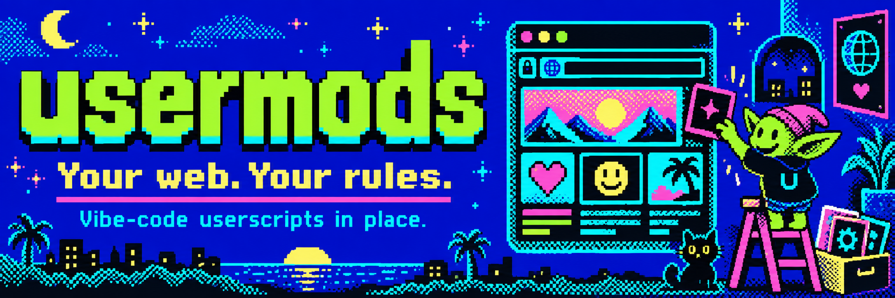</p>

# usermods

**Vibe-code userscripts in place.** An open-source browser extension that lets you customize any website by chatting with the LLM of your choice.

Open the side panel on any page, describe what you want changed, and usermods inspects the page, writes a userscript, tests it live, and hands it to you with *Try* and *Save* buttons. Saved mods run automatically on every matching page load. Export them as standard `.user.js` files, install ones from Greasy Fork, or [migrate your whole Tampermonkey library in one file](#migrating-from-tampermonkey).

Userscripts, userstyles, usermods.

<p align="center">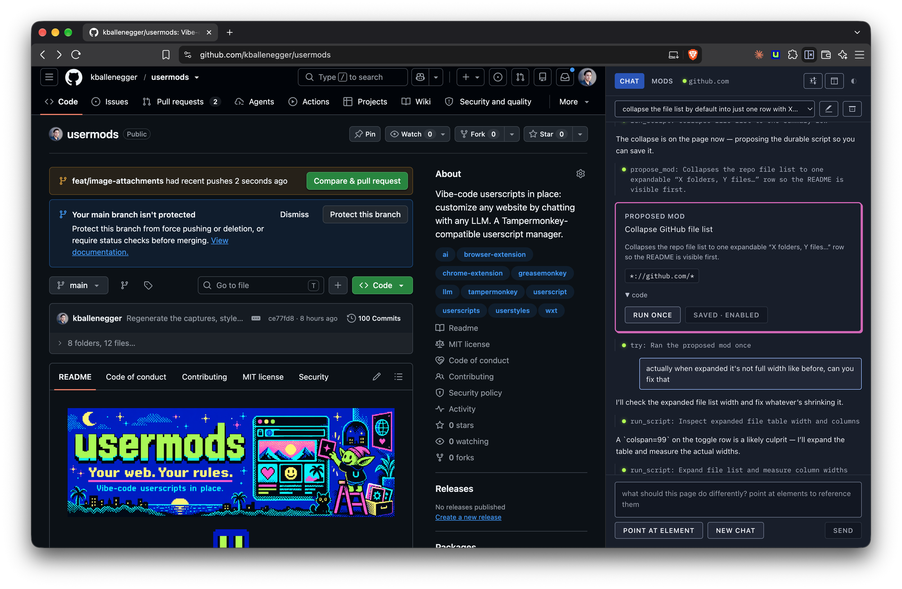</p>

## Why

- **Any backend.** Anthropic's API, OpenAI, OpenRouter, or anything OpenAI-compatible: Ollama, LM Studio, vLLM, mlx_lm. Your key, your machine, no account, no hosted service.
- **Use the subscription you already pay for.** Sign in with ChatGPT (Plus, Pro, Team) or SuperGrok / X Premium+ straight from Settings. No API key, no local proxy, no per-token bill. [Details](#using-a-subscription-instead-of-an-api-key).
- **The model actually sees the page.** It has tools to read a pruned DOM, list elements, read computed styles, take screenshots, and run scripts to test its work before proposing anything.
- **One-off tasks too.** "Scroll to the bottom, open every carousel, and give me download links for all the photos" runs as a script, no mod required.
- **Portable.** Mods are plain userscripts with a `==UserScript==` header. Nothing proprietary.
- **MIT.**

## Status

Early. The core loop works end to end: chat, page inspection, live testing, propose, save, run on load, import and export. Outside userscripts install from a URL, a `.user.js` link or a file, with the `GM_*` API and `@require`/`@resource` support they expect, and a Tampermonkey backup imports in one step. See [Roadmap](#roadmap).

## Screenshots

<table>
  <tr>
    <td width="50%" valign="top">
      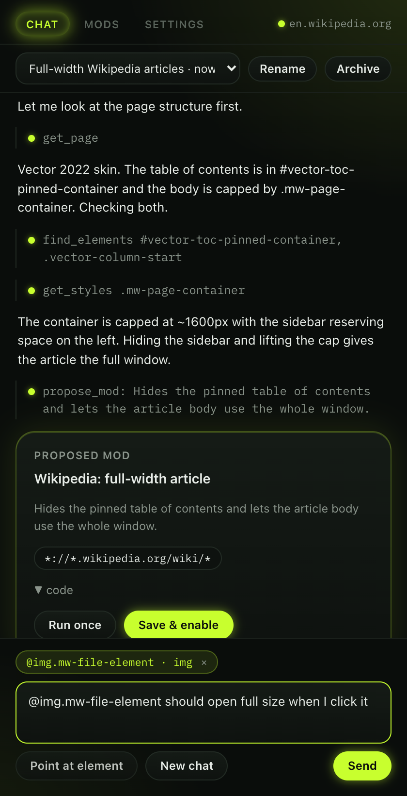
      <sub><b>Point at an element.</b> Clicking one on the page drops an <code>@reference</code> into your message, so you can say "this" and mean it.</sub>
    </td>
    <td width="50%" valign="top">
      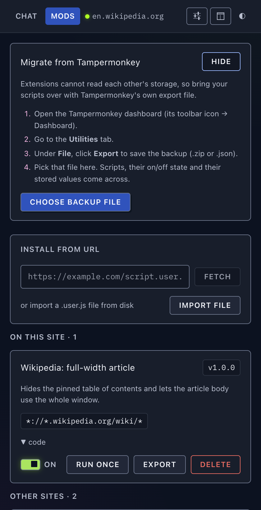
      <sub><b>Migrating.</b> One Tampermonkey backup file brings the whole library across, on/off state and stored values included.</sub>
    </td>
  </tr>
  <tr>
    <td width="50%" valign="top">
      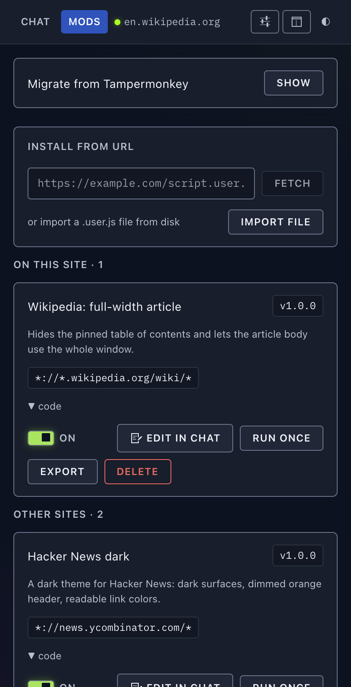
      <sub><b>Mods.</b> Saved scripts, split by whether they match the page you are on. Toggle, run, export or delete each one.</sub>
    </td>
    <td width="50%" valign="top">
      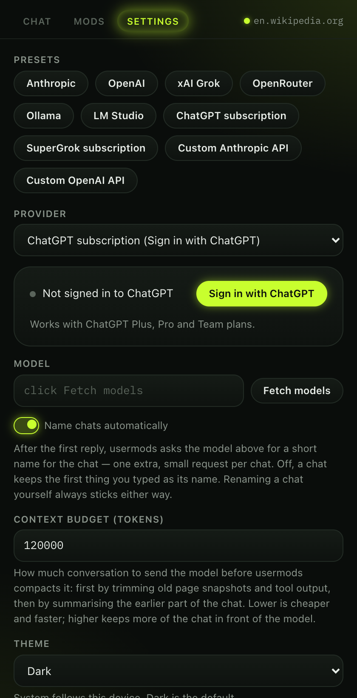
      <sub><b>Settings.</b> Presets for the common backends, and a sign-in card for the two subscriptions that work without an API key.</sub>
    </td>
  </tr>
  <tr>
    <td width="50%" valign="top">
      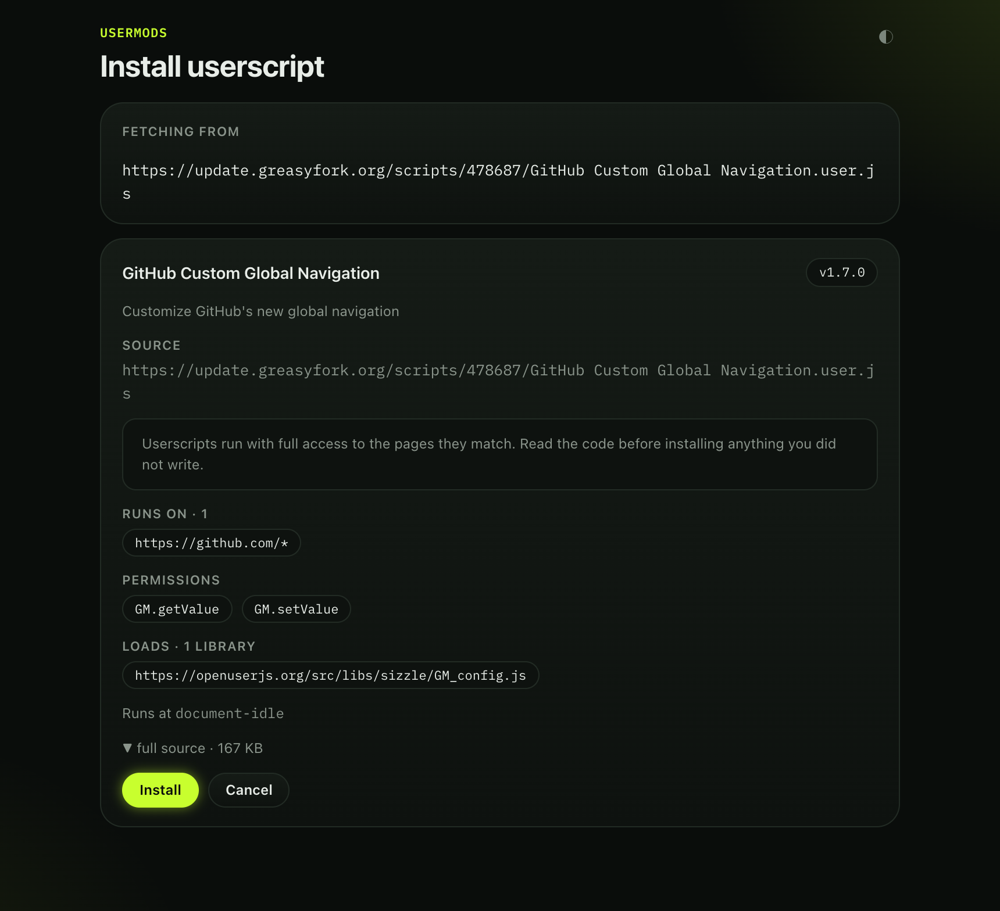
      <sub><b>Installing an outside script.</b> A <code>.user.js</code> link shows what it matches, what it is granted and what it loads, before anything is saved.</sub>
    </td>
  </tr>
</table>

### Design

The interface is built on the banner, at the banner's hues rather than its saturation: a deep navy
page and panels on the electric blue's own hue, the blue itself for buttons, links and the active
tab, lime reserved for anything **alive**, pink for the hero card's edge and element chips, cyan for
focus. Anything you actually read — the transcript, code, the editor, settings help — sits on a solid
panel in a text face at a comfortable size, because the system's first principle is **calm, branded,
legible**.

> **Note.** This branch is **option B**, one of two design options open for comparison; neither is
> merged. Option A applies the same identity boldly — the electric blue as the page itself, bright
> 2px borders, hard offset shadows and pixel type throughout. The two are behaviour-identical.
> [§2 of the design doc](docs/design.md#2-what-is-different-from-option-a-concretely) is a
> side-by-side.

**[docs/design.md](docs/design.md)** is the full style guide: the palette with hexes and OKLCH values
for both themes, the contrast table, typography, every component with its states and do/don'ts,
theming and the accessibility commitments. It embeds a living specimen rendered with the real
stylesheets, so it shows the system rather than describing it.

### Light and dark

The panel follows your OS by default, and the ◐ in the tab bar cycles Dark → Light → System from
anywhere. Day is its own design pass, not night inverted: the identity colours drop to the tones that
can carry text on white, the page is a cool white tinted on the same hue as night's navy, and every
glow turns off — there is no neon in daylight. Both themes meet WCAG AA and hold long-form reading
pairings to 7:1, which `test/contrast.test.ts` enforces against the token file.

<table>
  <tr>
    <td width="50%" valign="top">
      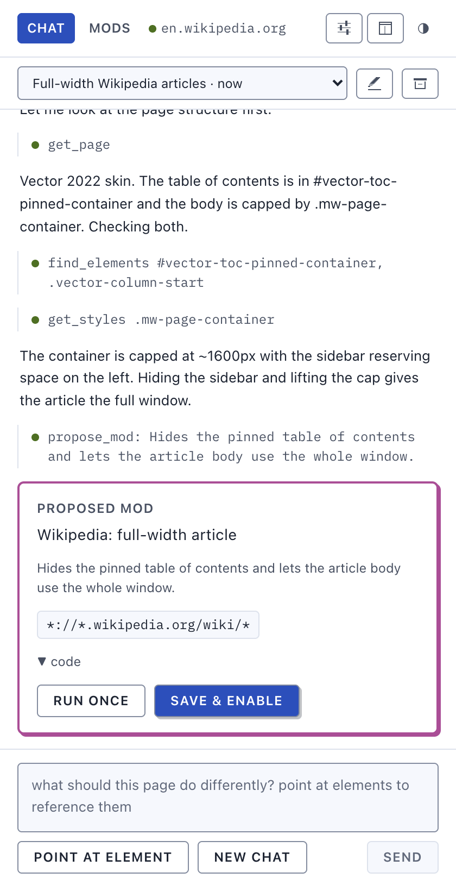
      <sub><b>Chat, day.</b></sub>
    </td>
    <td width="50%" valign="top">
      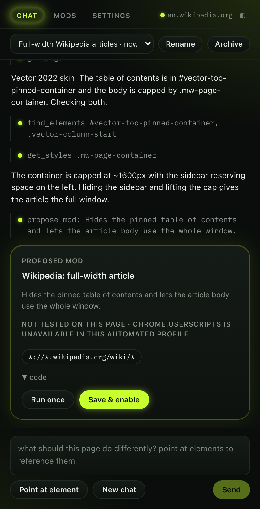
      <sub><b>Chat, night.</b></sub>
    </td>
  </tr>
  <tr>
    <td width="50%" valign="top">
      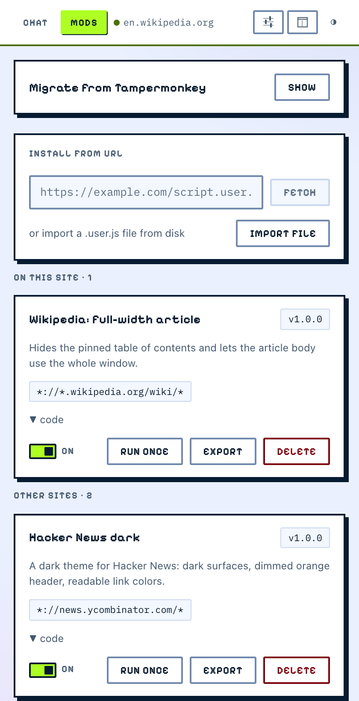
      <sub><b>Mods, light.</b></sub>
    </td>
    <td width="50%" valign="top">
      
      <sub><b>Mods, dark.</b></sub>
    </td>
  </tr>
  <tr>
    <td width="50%" valign="top">
      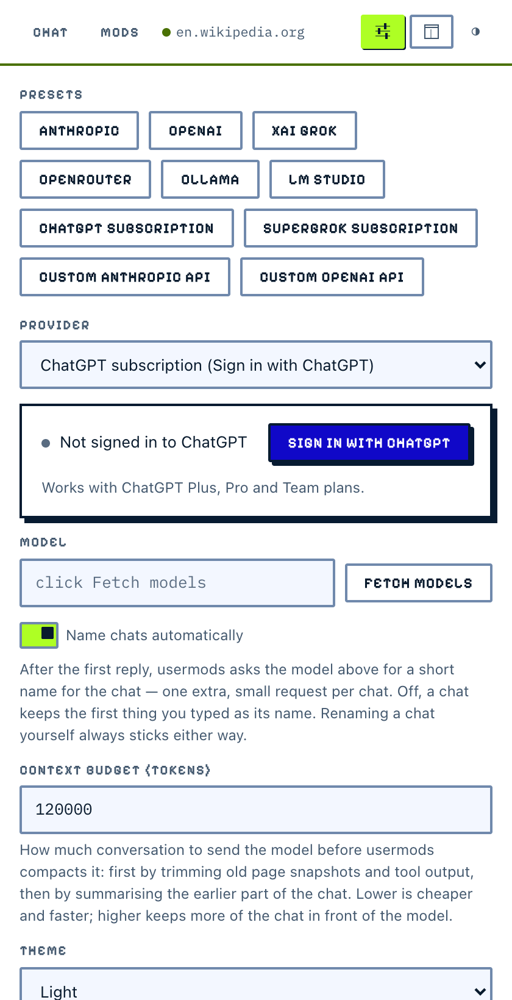
      <sub><b>Settings, light.</b></sub>
    </td>
    <td width="50%" valign="top">
      
      <sub><b>Settings, dark.</b></sub>
    </td>
  </tr>
  <tr>
    <td width="50%" valign="top">
      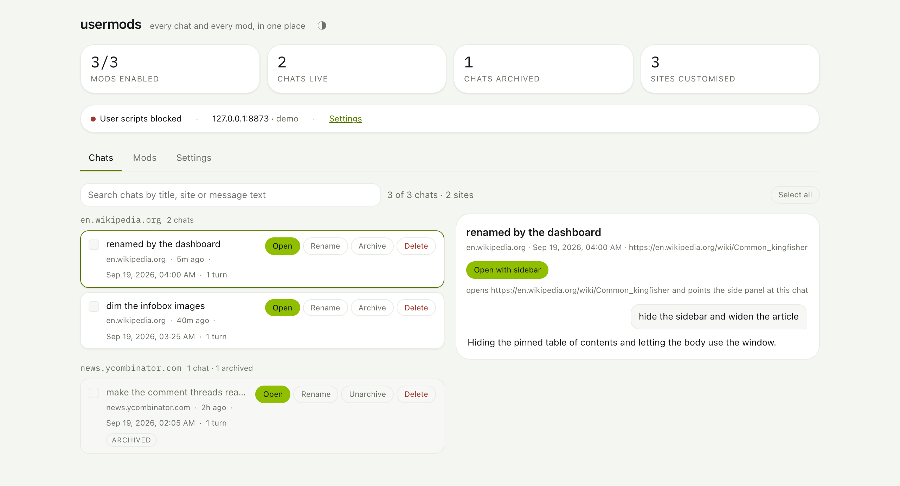
      <sub><b>Dashboard, light.</b> Every chat and every mod in a full tab — see <a href="#dashboard">Dashboard</a> below.</sub>
    </td>
    <td width="50%" valign="top">
      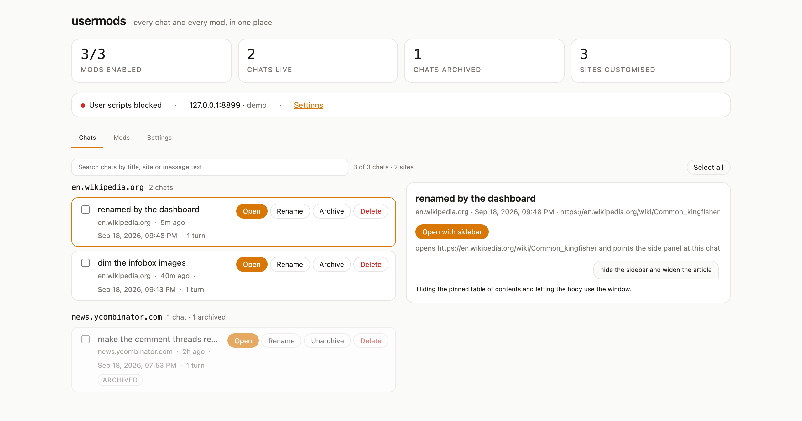
      <sub><b>Dashboard, dark.</b></sub>
    </td>
  </tr>
</table>

## Install (from source)

Requires Node 22+ and Chrome 135+.

```sh
npm install
npm run build
```

Then in Chrome:

1. Open `chrome://extensions`, turn on **Developer mode**, click **Load unpacked**, and pick `.output/chrome-mv3`.
2. Click **Details** on usermods and turn on **Allow User Scripts**. Chrome requires this toggle for any extension that runs user scripts, including Tampermonkey.
3. Click the usermods icon to open the side panel **on that tab**. Go to **Settings**, pick a provider, paste a key (or a local server URL), and save.

### Where the panel opens

By default the panel belongs to the tab you opened it on. Switch to another tab and it is not
there; come back and it is, still on the same chat. That matches what the panel actually shows —
this site's chats, this site's mods — so it is never sitting over an unrelated tab claiming to be
about it.

*Side panel opens* in **Settings** has the other choice: **On every tab** is Chrome's window-wide
panel, which follows you from tab to tab until you close it, and is how usermods behaved before
this setting existed. The change takes effect on the next click of the toolbar icon — no reload.

The toolbar icon only opens the panel; Chrome gives extensions no way to close one, so closing is
the ✕ in the panel's own header.

For development, `npm run dev` starts WXT with hot reload and opens a Chrome profile with the extension loaded. `npm run typecheck` type-checks, and `npm test` runs the header/backup parser tests (Node's built-in runner, no browser needed).

`npm run screenshots` regenerates the images above, and `npm run smoke` runs the same flow headless as an end-to-end check of the chat loop. Both build the extension, load it into Playwright's Chromium, and drive the real side panel against `scripts/mock-llm.mjs` — a local server that plays scripted conversations over the OpenAI wire protocol, so neither needs an API key or a live model. The page-inspection tools run for real against live pages, and the smoke run asserts that the reply streams, that `get_page`, `find_elements` and `get_styles` all succeed, that the proposal card appears with the expected name and match pattern, and that saving it writes a userscript to storage. A second scripted conversation covers the agent's guardrails: it makes four page reads in a row and then proposes an untested mod, and the smoke reads the mock's recorded requests back from `GET /__requests` to prove the read-budget nudge and the propose-time refusal actually reached the model. A third (`npm run smoke:wait`) drives every `wait_for` condition against a fixture page the mock server serves itself, where content arrives 800ms late, an element is revealed by editing a CSS rule and nothing else, the route changes by `pushState`, and a region mutates for 1.5s and then settles — asserting from the recorded requests that an already-true condition returned in under 100ms, that the style-only reveal was noticed promptly (which only the polling floor can do), that a deliberate timeout carried diagnostics and was not flagged as an error, and that Stop ends a 20-second wait within 500ms leaving no observer behind. See the comments at the top of `scripts/screenshots.mjs` for how the panel page is driven in an ordinary tab standing in for the real panel — and, in the panel-scope flow, how the real panel is opened and observed instead.

`npm run smoke` runs four flows: the chat loop above, the chats flow (`npm run smoke:chats` — the
panel restoring the last chat, archiving, unarchiving on send), the dashboard flow
(`npm run smoke:dashboard` — host grouping and counts, search narrowing on titles, hosts and
message text, the transcript preview, inline rename, archive, the "open this chat on its page"
handoff, toggling a mod through to storage, editing a mod's source, and bulk actions) and the
panel-scope flow (`npm run smoke:panelscope`). That last one drives the *real* side panel: a
Playwright click is a trusted user gesture, which is all `chrome.sidePanel.open` asks for, so
clicking *Open* genuinely opens a panel. Playwright never lists the panel as a page, so the flow
observes it through the extension's own APIs — `chrome.runtime.getContexts()` reports a
`SIDE_PANEL` context, and `chrome.sidePanel.getOptions()` says which tab it is attached to. It
asserts that under the default scope the window-level panel is disabled, that the clicked tab gets
tab-specific options while a second tab in the same window still reports the disabled default, that
those options survive the tab navigating to the chat's page, and that flipping the setting to *on
every tab* and back reconfigures Chrome both ways.

## Providers

Two wire protocols, any endpoint:

| Preset | Protocol | Base URL |
|---|---|---|
| Anthropic | Anthropic Messages | `https://api.anthropic.com` |
| OpenAI | OpenAI chat completions | `https://api.openai.com/v1` |
| xAI Grok | OpenAI chat completions | `https://api.x.ai/v1` |
| OpenRouter | OpenAI chat completions | `https://openrouter.ai/api/v1` |
| Ollama, LM Studio, vLLM, mlx_lm | OpenAI chat completions | your local server |
| Custom | either | anything you type |

The base URL is always editable. Anything that speaks one of the two protocols will work, so a self-hosted gateway, a corporate proxy, or a model router all drop in.

### Using a subscription instead of an API key

Two subscriptions can sign in directly from Settings, with no API key and no local process:

| Preset | Plans | How |
|---|---|---|
| ChatGPT subscription | Plus, Pro, Team | "Sign in with ChatGPT" device code. Opens a page, you type a short code, done. |
| SuperGrok subscription | SuperGrok, or X Premium+ on the X account you sign in with | xAI's coding-agent OAuth, same device-code flow. |

Both talk to the vendor's Responses API backend that their own coding agents use. Tokens are stored in extension local storage and refreshed automatically. Use **Fetch models** after signing in to see which model ids your plan allows.

Caveats worth knowing:

- Neither vendor publishes developer docs for this. The endpoints and headers are the ones their CLIs use, as reused by several open-source agents. OpenAI and xAI have both said third-party tools may use these logins, but that is a statement, not a contract.
- Usage counts against your plan's limits.
- xAI has been seen to reject some standard-tier SuperGrok accounts with a 403 even when the subscription is active.
- Anthropic forbids using a Claude subscription outside its own clients, so there is no Claude sign-in. Anthropic's sanctioned route is the Agent SDK credit, which requires the Claude Code CLI on your machine. If you run a local proxy built on that, point a Custom Anthropic preset at it.

For any other subscription, the same rule applies: run a local proxy that exposes it as an Anthropic- or OpenAI-compatible endpoint and point a Custom preset at it.

**Not in the Chrome Web Store build.** Subscription sign-in ships only in the GitHub build — the one you get from [Install (from source)](#install-from-source) above. `npm run build:store` and `npm run zip:store` produce the Web Store variant, which sets a compile-time flag that removes the two subscription presets, their provider options and the sign-in card, and tree-shakes the OAuth module out of the bundle entirely, so that build contacts no vendor auth endpoint. These logins rely on endpoints neither vendor documents or licenses for third parties, which does not fit a listing that has to declare exactly what it talks to. If you install the Web Store build over a profile that was signed in, Settings falls back to the default provider and tells you why; the GitHub build keeps every feature, this one included.

## Importing scripts and migrating from Tampermonkey

usermods runs ordinary userscripts, so you can bring in scripts from Greasy Fork, OpenUserJS or your own collection.

**Install from a URL.** Paste a `.user.js` URL into *Install from URL* in the Mods tab and click **Fetch**. You get a preview — name, version, what it matches, which `GM_*` permissions it asks for, the libraries it loads, and the full source — before anything is saved.

**Click a `.user.js` link.** usermods redirects `.user.js` navigations to its own install page, the way Tampermonkey does, so clicking an install link on Greasy Fork shows the same preview instead of a wall of raw JavaScript. The script's URL travels in the install page's fragment (`install.html#https://…`) and everything after the first `#` is taken verbatim, so a link whose own query string carries another `url=` cannot change which script is previewed. The page shows the exact URL it is about to fetch, and refuses anything that is not `http`/`https`.

**Import a file.** *Import file* in the Mods tab takes a `.user.js` file from disk through the same preview.

`@require` libraries and `@resource` files are downloaded at install time and stored with the mod, because registered scripts cannot fetch them later. If one of those downloads fails, the install fails and names the URL. Scripts with a `@downloadURL` get an **Update** button that refetches and compares `@version`.

### Migrating from Tampermonkey

Chrome extensions cannot read each other's storage, so migration goes through Tampermonkey's own export file:

1. Open the Tampermonkey dashboard (its toolbar icon → **Dashboard**).
2. Go to the **Utilities** tab.
3. Under **File**, click **Export** to save the backup (`.zip` or `.json`).
4. In usermods, open the **Mods** tab, expand **Migrate from Tampermonkey**, and pick that file.

Both export shapes work: the JSON document (an object with a `scripts` array) and the ZIP (one `.user.js` per script plus its `.options.json` and `.storage.json` sidecars, or the older JSON-in-`.txt` entries). Each script comes across with its enabled/disabled state, its `GM_setValue` store and its update URL.

A script already installed is recognised by its `@downloadURL`, or by `@namespace` + `@name` when it has none — not by name and version, so a newer version of a script you already have updates it in place instead of installing a second copy beside it. Updating in place keeps the mod's id, its registration and its existing stored values, with the backup's values merged over the top for the keys the backup carries. The import reports how many scripts came in, how many were updated, and what it could not read.

### GM API compatibility

| Function | Status |
|---|---|
| `GM_info` / `GM.info` | Supported |
| `GM_addStyle`, `GM_addElement` | Supported |
| `GM_getValue`, `GM_setValue`, `GM_deleteValue`, `GM_listValues` (and `GM.*`) | Supported. Reads come from a snapshot taken when the script was registered; writes persist immediately and are pushed live to the script's other open tabs. |
| `GM_getResourceText`, `GM_getResourceURL` | Supported, from `@resource` files fetched at install time |
| `GM_xmlhttpRequest` / `GM.xmlHttpRequest` | Supported, cross-origin, via the background worker, subject to `@connect`. `responseType` `arraybuffer`, `blob`, `json`, `document` and text all work, with `responseXML` for `document`. `onload`, `onerror`, `onloadend` and `abort()` work; streaming and upload progress events do not. |
| `GM_openInTab` / `GM.openInTab` | Supported, with Tampermonkey's focus rules: `GM_openInTab(url)` opens in the foreground, `GM_openInTab(url, true)` and the object form without `active: true` open in the background. The returned handle is a stub: `close()` does nothing. |
| `GM_setClipboard`, `GM_log` | Supported |
| `GM_registerMenuCommand`, `GM_unregisterMenuCommand` | **Stub.** Commands are recorded but there is no menu UI to invoke them. |
| `GM_notification` / `GM.notification` | **Stub.** Logs to the console instead of showing a desktop notification. |
| `GM_getTab`, `GM_saveTab`, `GM_getTabs` | **Stub.** Return empty objects. |
| `GM_addValueChangeListener`, `GM_removeValueChangeListener` | Supported. Fire for this script's own writes and for writes from its other open tabs, with `(key, oldValue, newValue, remote)`. In the page world (`@grant none`) only local writes fire. |
| `GM_download`, `GM_cookie`, `GM_webRequest` | Not implemented |

#### `@connect`

`GM_xmlhttpRequest` is cross-origin, so a script may only reach the hosts its header declares. A request is allowed when its host equals or is a subdomain of a `@connect` entry, when the script declared `@connect *`, or when it declared `@connect self` and the host is one the script's own `@match`/`@include` lines cover (a `*://*.example.com/*` pattern covers `example.com` and its subdomains; a script matching every site gains nothing from `self`). Anything else is refused with an error naming the host and the `// @connect <host>` line that would permit it. The install preview lists the `@connect` entries next to the `GM_*` permissions, so you can see what a script intends to talk to before it is saved.

Scripts and their `@require` libraries are evaluated in their own function scopes, not in one shared strict-mode closure, so sloppy-mode libraries and scripts behave as they do under Tampermonkey. A script gets strict mode only from its own `'use strict'` directive.

`@grant none` and `unsafeWindow` scripts run in the page's **MAIN** world, where they share globals with the page — which is what those scripts want. The trade-off is that extension messaging is unavailable there, so `GM_setValue` writes from a MAIN-world script update the in-page copy but **cannot be persisted**. Mod cards and the install preview mark those scripts with a *page world* badge. Everything else runs in Chrome's isolated `USER_SCRIPT` world.

Regex-style `@include` lines (`/^https?:\/\/…$/`) are not supported; Chrome matches on patterns and globs only. The install preview warns when it drops one.

## Dashboard

The side panel is scoped to the page you are on — by default to the tab as well: it shows that site's chats and highlights that
site's mods. The dashboard is the other half — everything, everywhere, in a full tab.


Open it from the **Dashboard** button in the side panel's tab bar, from the toolbar icon's context
menu (**Options**), or from **Details → Extension options** in `chrome://extensions` — it is
registered as the extension's options page, so all three land on the same tab. Opening it twice
focuses the tab you already have rather than stacking up copies.

**Chats.** Every chat across every site, grouped by host with counts, most recently used site
first. The search box filters on title and host immediately, and on the message text inside stored
transcripts as those load — transcripts live in their own storage keys, so they are read lazily,
debounced and capped rather than all at once. Each chat can be renamed inline, archived, deleted,
or opened; clicking one shows its transcript read-only beside the list, so you can re-read an old
conversation without going back to the site. Select several for a bulk archive or delete.

**Reopening a chat.** *Open* puts you back where the chat was: the page the chat was last used on,
with the side panel showing that chat rather than whatever the panel would otherwise have restored.
With the default *on this tab only* scope it goes there in the dashboard's own tab, because that is
the only way to have the panel open on the right tab — `chrome.sidePanel.open` has to be called
inside the click that asked for it, before the destination tab could exist, so usermods opens the
panel on the tab it already has and then navigates that same tab (a tab keeps its id, and its panel,
across a navigation). *Open in new tab* beside it keeps the dashboard where it is and loads the page
in a new tab; open the panel there yourself. Under *on every tab* scope, *Open* behaves as it always
did: a new tab and the window-wide panel.

Chats remember their page from the turn they were last used on; chats recorded before that existed
fall back to the site's front door. Opening an archived chat this way does not unarchive it — as in
the panel, only sending a message does.

**Mods.** Every saved script with its version, match patterns, grants, world, size, when it changed
and where it came from (a download host, *written in chat*, or *imported*). Filter by site or by
enabled state; toggle, export, update or delete one at a time, or select several to enable, disable,
delete, or export together as a zip. Selecting a mod opens its source in an editor beside the list:
saving re-parses the header, so editing an `@name` or a `@match` line updates the mod and
re-registers it, with the same parse warnings the install screen shows. *Install from URL*, *Import
file* and *Migrate from Tampermonkey* are all here too.

**Settings** is the same view the side panel shows, so the dashboard is a complete home: Chats ·
Mods · Settings. The strip across the top counts what you have, shows whether *Allow User Scripts*
is on, and names the provider and model in use.

Anything changed in the side panel shows up here without a reload, and vice versa.

## How it works

```
side panel (React)  ──rpc──▶  background service worker  ──▶  LLM provider (streaming, tool calls)
        │                             │
        │                             ├──▶ content script: DOM snapshot, element picker, selectors, styles
        │                             ├──▶ chrome.userScripts.execute: run a draft once, capture result + console
        │                             └──▶ chrome.userScripts.register: saved mods run on matching pages
        └── Try / Save / Enable
```

- **Provider adapters** live in `lib/providers/`. Anthropic uses the official SDK; the OpenAI-compatible adapter speaks `chat/completions` with function calling over raw fetch. Adding a provider means implementing one `chat()` method.
- **The agent loop** (`lib/agent/`) is provider-neutral. Tools: `get_page`, `find_elements`, `get_styles`, `run_script`, `wait_for`, `screenshot`, `propose_mod`.
  - `wait_for` is how the agent handles a page that is still working. Pages are asynchronous — content lazy-loads after a scroll, a click's result arrives 800ms later, a SPA changes route without navigating, a modal animates in — and without a way to wait the model polls with `run_script`, burns its step budget and gets nudged for over-reading, or proceeds too early and reports failure. One call takes exactly one condition: a selector (with `attached` / `visible` / `hidden` / `detached`, an optional `count`, an optional text filter), page text appearing or disappearing, a URL matching a substring or `/regex/`, a load state, the DOM going quiet for `quiet_ms`, or a plain `ms` delay as a documented last resort. DOM conditions are watched in the content script by a `MutationObserver` with a polling floor under it — a page that reveals an element by editing a CSS rule mutates nothing at all, and the observer is structurally blind to that — while URL and load conditions are watched in the background, because the navigation being waited for destroys the content script. A condition that is already true returns in about a millisecond, and **a timeout is not an error**: it comes back as a plain statement with the diagnostics that tell the two cases apart (`0 elements match .result; closest: 12 element(s) match li` versus `document.readyState=complete; 14 mutation batches observed in the last 5s`), so the model can tell "never going to happen" from "still loading". Waiting counts as a step but is neither a page read nor an act, so it cannot trip the read budget or launder a read streak; a separate guard nudges the model after more than three waits in a row or a minute of cumulative waiting in one turn. Stop ends a wait immediately and leaves no observer, listener or timer behind.
  - `run_script` also takes an optional `then_wait` with that same condition shape, so "click it, then wait for the result" is one step instead of two — and a script that navigates the page composes sensibly with a `url` or `load` condition, where the navigation is the expected outcome rather than a lost result.
  - `run_script` really does return the value of the last expression. The code is injected as an async function body, where only an explicit `return` would yield a value, so the background parses it with acorn and rewrites a trailing expression statement into a `return` (`lib/runscript.ts`) — `1 + 1` reports `2`, and code that does not parse is refused with a line and column instead of being injected broken. A script that only changes the page reports `Completed. No return value. DOM: 14 removed, 0 added, 2 attributes changed.` from a `MutationObserver` the wrapper runs around it, so "it did nothing" and "it worked and returned nothing" are no longer the same message. A lost result is named for what it was: a navigation mid-run, an injection that was refused, a thrown error (its stack trimmed to your code's frames, with the line numbers you wrote) or a real 20-second timeout.
  - `find_elements` labels how durable each selector is — `[stable: id]`, `[stable: data-attr]`, `[fragile: generated class]`, `[fragile: positional]` — and the prompt spends the model's second look only on the fragile ones.
  - `propose_mod` refuses a proposal that has not been tested with `run_script` since the last one, that does not parse, that uses `eval`, `new Function`, `document.write` or an inline handler attribute, or whose `@match` covers every site when you did not ask for that. Each refusal is a tool error the model recovers from in the same turn. `untested_reason` overrides only the first check, and the proposal card tells you it was never run.
  - The turn is capped at 30 model round-trips. Five from the end the model is told to wrap up; if it still runs out, the panel says `stopped after 30 steps · send a message to continue` rather than simply going quiet. A counter also watches page reads: four in a row with nothing run or proposed and the model is told to act.
- **Context compaction** (`lib/agent/compact.ts`) keeps a long chat inside the model's context window. A page snapshot can be 60,000 characters and the history used to resend every one of them forever. Before each model call usermods estimates the size of the conversation and, once it passes 70% of the **context budget**, does the cheap thing first: it replaces the *content* of old bulky tool results — page snapshots, element listings, style dumps, screenshots, script logs — with a one-line stub the model can act on (`[elided · get_page result · 48,102 chars · call get_page again if you need it]`), largest and oldest first. The most recent couple of turns, the latest result of each tool, and every `propose_mod` call are never touched, so the mod you are working on and the model's fresh view of the page both survive. If that is still not enough, one extra tool-free call to the same model folds the older half of the chat into a single summary — your goals, the decisions and the rejected approaches, every selector found and whether it held up, the full text of the current proposal — and the three most recent turns stay verbatim. Cuts land only at turn boundaries, so a tool call is never separated from its result. If that summary call fails, the oldest turns are simply dropped rather than failing your turn. Either way the panel shows a muted line (*earlier tool output trimmed · 148k → 61k tokens*) and **your transcript is never rewritten** — only the history sent to the model shrinks. The budget is *Context budget* in Settings, 120,000 tokens by default; lower is cheaper and faster, higher keeps more of the chat in front of the model. Each compaction invalidates the provider's prompt cache from the oldest message it touched, which is why it runs in batches at a threshold rather than trimming a little every turn.
- **Mods** are stored in `chrome.storage.local` as full userscript text. The header is parsed for name, description, `@match`/`@include`/`@exclude`, `@grant`, `@require`, `@resource`, `@run-at` and `@noframes`. Enabled mods are registered with `chrome.userScripts`, each wrapped in a closure that provides the `GM_*` and `GM.*` API, in the world and at the run-at its header asks for.
- **Chats** are per site and live in `chrome.storage.local`, so they survive the panel closing, the service worker sleeping and a browser restart. Opening the panel on a site brings back its last chat, transcript and all, without a click; that keeps happening until you start a new one or **archive** it. Archiving is the switcher's main "done with this" action and needs no confirmation, because it is reversible: archived chats move to an *Archived* group at the bottom of the switcher, where you can reopen one (sending in it unarchives it), put it back, or delete it for good. Only deleting asks. Chats name themselves: once the first turn finishes, usermods makes one small extra call to the same model — no tools, a few hundred characters of the exchange — and asks for a three-to-six-word title, refreshing it once more when the chat reaches its fourth turn. That call happens after your turn is done and is never allowed to slow it down or fail it; if it errors, the truncated first message stays. **Rename** in the switcher gives a chat your own name, and nothing overwrites that afterwards. Turn the whole thing off with *Name chats automatically* in Settings. Runs are isolated per chat and several can be in flight at once on different tabs: a chat keeps streaming into its own transcript while you read another one, and Stop only stops the chat you are looking at. The index is capped at 200 chats per profile, oldest dropped, with archived chats evicted before live ones, and screenshots are stripped from stored history.

## Security notes

- Page content that the model reads is untrusted. The system prompt tells the model to treat it as data, and every generated script is shown to you before it is saved. Read it.
- Scripts run in an isolated world: they see the DOM but not the page's JavaScript globals. Default `@match` is the current site only.
- Your API key is stored in extension local storage and sent only to the endpoint you configure.

Found a vulnerability? Please report it privately through GitHub's **Report a vulnerability** button
rather than opening an issue. [SECURITY.md](SECURITY.md) has the scope and what to expect.

## Privacy

usermods has no server, no account and no telemetry. The author receives nothing.

To change a page, the model has to see it, so when you send a message usermods sends — **directly
from your browser to the endpoint you configured, and nowhere else** — your message, the page's
address and title, a pruned copy of its HTML, details of elements it looks up or you point at, and a
screenshot of the visible tab when the model asks for one. If the page is your mailbox or your bank,
that content goes too; close the panel on pages you would rather not share. Point usermods at a
local model and nothing leaves the machine at all.

Your API key, subscription tokens, saved mods, their `GM_setValue` stores and your chat history all
live in extension local storage on your device. Keys and tokens are sent only to the endpoint they
authenticate.

The panel says all of this in the side panel before your first message, and the notice is always
available again from Settings → *Review data notice*. The full policy is in
[PRIVACY.md](PRIVACY.md); the Chrome Web Store submission material is in
[docs/store/](docs/store/).

## Roadmap

- Agent mode with proper click, type and scroll tools plus screenshot-driven verification, for tasks the DOM-script approach handles poorly.
- Edit an existing mod from chat ("make the button blue instead").
- Mod sharing: export is there; a gallery is not.
- CSS-only mods via a `@usermods-style` header, so pure restyles need no JavaScript.
- Firefox, once its side panel story is settled.

## Contributing

Issues and pull requests are welcome. [CONTRIBUTING.md](CONTRIBUTING.md) covers the setup, the npm
scripts, where everything lives, how to add a provider, and the one hard rule: every fix lands with a
regression test. The [Code of Conduct](CODE_OF_CONDUCT.md) sets out how this project is run and the
one line it draws.

## Author

Made by [Kenneth Ballenegger](https://github.com/kballenegger).

## License

MIT © Kenneth Ballenegger
