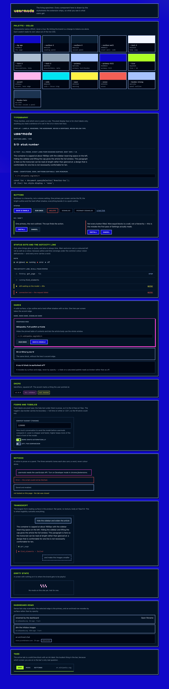
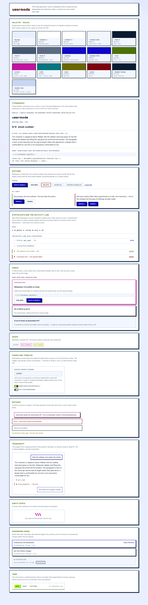

# The usermods design system — option B: the muted banner palette

This is the reference you design from. It describes what the interface is made of, why each piece is
the way it is, and the rules that decide the cases it does not cover.

> **This is one of two options under review.** Option A (on `main`) takes the banner literally: the
> electric blue *is* the page, every panel takes a 2px bright border and a hard ink shadow, and every
> label is pixel type. Option B — this document — keeps the same identity and turns the volume down.
> Neither is merged. See [`design/explorations/`](design/explorations/) for the comparison.

The identity — the banner, the icon, the palette, the voice — lives in [branding.md](branding.md).
This document is how that identity becomes an interface.

---

## 1. First principle: calm, branded, legible

> Calm, branded, legible — in that order, because they only conflict if you get the order wrong.

The banner is a poster. The side panel is a place you read in for half an hour at a time. Those two
want different things from the same six colours, and the difference is not taste — it is duration. A
poster wants the colour to be the subject; you look at it for two seconds. A reading surface wants
the colour to be the frame; you look at it all afternoon.

So the rule here is the inverse of option A's:

> Take the banner's **hue**, then pull its **chroma** down for anything larger than a dot or a
> border. Saturation is a highlighter: it marks the few things that are alive, selected or wrong,
> and it stops being informative the moment it covers a whole page.

**The identity hexes are not edited.** They are still the brand, they are still recorded below, and
the icon, banner and store artwork still use them literally. What changes is how much of the
interface each is allowed to cover. Every interface tone was derived in OKLCH from a banner hex with
the hue held and the chroma reduced.

**Being branded is not the same as being loud.** The thing that makes this recognisably usermods is
that every neutral in it sits on hue 266 — the banner blue's own hue. Put the surface ramp beside a
true grey and the cast is obvious. The brand is in the surfaces even when no brand colour is on
screen, which is most of the time.

The only thing never traded away is reading:

- **Long-form reading surfaces** — assistant prose, code blocks, the mod source editor, settings
  help, the consent notice, the install preview's source — are set in a proportional or mono **text**
  face, at **body ≥ 13px / code ≥ 12px**, on a **solid, untextured panel**. Body copy targets **7:1**,
  and `test/contrast.test.ts` asserts that figure rather than AA's 4.5:1 for those pairings.
- **Nothing is ever drawn behind text.** The ambient wash is two corner glows at about a third of
  option A's strength, and anything carrying prose paints its own solid surface over it.
- **The pixel display face has two jobs**: the `usermods` wordmark and the large stat numbers. It is
  the signature, not the voice.

---

## 2. What is different from option A, concretely

Useful for comparing the two at a glance. Everything here is a design change; no behaviour differs.

| | Option A (`main`) | Option B (this) |
| --- | --- | --- |
| Night page | `#1008C8`, the banner's electric blue | `#0C1220`, deep navy on the same hue |
| Night panel | ink `#041325`, *darker* than the page | `#181E2B`, *lighter* than the page |
| Panel edge | 2px bright `#A7C2FE` | 1px quiet `#6B748A` |
| Panel separation | carried by the border (page and panel are 1.68:1) | carried by a luminance step (1.30:1) plus the line |
| Shadows | 4px hard ink under every card | none, except the primary button and the hero card |
| Radii | 0px — square throughout | 4–6px |
| Labels, tabs, buttons | Jersey 10 pixel type | system UI at 600 |
| Display face | everywhere short | wordmark and stat numbers only |
| Active tab | solid lime block | solid primary block |
| Lime | tabs, stat numbers, the bar's rule, alive | **alive only** |
| Pink | hero edge, chips, wordmark shadow, selection | hero edge and chips only |
| Body contrast | AA enforced | **7:1 enforced** for reading pairings |

The structural point is the third row. Option A's panel is *darker* than its page and only 1.68:1
away from it, so a border is the only thing that can carry the edge and it has to shout. Option B's
panel is *lighter* than its page, so the edge is carried by the step and the line only has to
confirm it. That one inversion is what pays for the quieter borders, the missing shadows and the
smaller radii — they are consequences of it, not separate decisions.

---

## 3. The palette

### 3.1 Identity — the banner's own colours

These six are the brand, taken from `docs/banner.png` unaltered, and they are the same in both
options. **They must never be edited to fix a contrast problem.**

| Role | Token | Hex | OKLCH | Used for, in this option |
| --- | --- | --- | --- | --- |
| Electric blue | `--brand-blue` | `#1008C8` | `oklch(38.3% 0.256 266)` | the *hue* of the page, panels, text and primary |
| Lime | `--brand-lime` | `#AEFF24` | `oklch(91.3% 0.237 130)` | the ok dot, at dot scale |
| Cyan | `--brand-cyan` | `#00E5F2` | `oklch(83.9% 0.143 202)` | the hue of focus and info |
| Ink | `--brand-ink` | `#030B16` | `oklch(14.7% 0.029 251)` | the darkest step of the surface ramp |
| Magenta | `--brand-pink` | `#F343D3` | `oklch(68.6% 0.254 336)` | the hue of the hero edge and element chips |
| Yellow | `--brand-yellow` | `#FFF345` | `oklch(94.5% 0.182 105)` | the hue of warning |

Only the lime appears in the interface at full identity strength, and only as a 7px dot. Everything
else is a reduced-chroma derivative on the same hue.

### 3.2 The surface ramp

Hue 266 at chroma 0.025–0.031 — roughly a **tenth** of the banner blue's 0.256. That is what makes
these read as navy rather than as blue, while holding the hue is what stops them reading as grey.

| Token | Hex | OKLCH | For |
| --- | --- | --- | --- |
| `--navy-900` | `#0C1220` | `18.5% 0.030 266` | the page |
| `--navy-850` | `#121723` | `20.5% 0.026 266` | the well |
| `--navy-800` | `#181E2B` | `23.5% 0.028 266` | the reading panel |
| `--navy-700` | `#212737` | `27.5% 0.030 266` | raised |
| `--navy-600` | `#2C3341` | `32.0% 0.028 266` | dividers inside a panel |
| `--navy-500` | `#6B748A` | `56.0% 0.035 266` | panel and control edges |

### 3.3 Tonal scales

Derived in OKLCH holding each identity hue steady, chroma reduced. Only the steps the UI uses exist.

| Scale | Tint (on dark) | Fill | Deep (text on white) |
| --- | --- | --- | --- |
| Blue (h 266) | `#98B6FB` text/border | `#3053BC` night fill, `#2C4FBB` day | `#2241A1` / `#17318D` pressed |
| Lime (h 130) | `#AAE560` alive on dark | `#AEFF24` the dot, `#B0EA69` day fill | `#4E6F23` text on white |
| Pink (h 336) | `#FABAE8` chip text | `#D262BA` hero edge on dark | `#AA4E96` text and edge on white |
| Cyan (h 202) | `#72D7DE` info + focus | `#68E3ED` day fill | `#1D767D` text on white |
| Yellow (h 105) | `#E0D96E` warn | `#ECE362` day fill | `#6F6915` text on white |
| Red (h 27) | `#E66B61` error on dark | — | `#861213` error on white |

Two of these deserve a note:

- **`--pink-300` is `#FABAE8`, a pale pink** rather than the mid tint. At `oklch(80%)` the accent and
  the error role sat under 1.6:1 apart in luminance, which is the only channel that survives a
  colour-vision simulation of that pair. 86% opens the gap to 2.11:1 without touching either hue.
- **Red is not a banner colour.** The banner has none. See [§3.6](#36-error-vs-accent-the-hard-case).

### 3.4 Night

A deep navy page with slightly lighter navy panels on it.

| Role | Token | Hex | For | Never |
| --- | --- | --- | --- | --- |
| Page | `--bg-app` | `#0C1220` | the page, the gaps between panels | — |
| Panel | `--surface-1` | `#181E2B` | every reading surface | — |
| Raised | `--surface-2` | `#212737` | hovered rows, your own messages, list rows | — |
| Well | `--surface-well` | `#121723` | code, editor, tool output | — |
| Body | `--text-1` | `#F1F3F9` | prose, titles | — |
| Secondary | `--text-2` | `#B8BECE` | descriptions, help, notices | — |
| Faint | `--text-3` | `#999EAB` | placeholders, markers, meta | long-form prose |
| Primary | `--primary` | `#98B6FB` | links, borders, active marks | as a fill |
| Primary fill | `--primary-fill` | `#3053BC` | primary buttons, the active tab | as text on a panel |
| Live | `--live` | `#AAE560` | running, enabled, ok; the only glow | anything not alive |
| Accent | `--accent` | `#FABAE8` | element chips | errors; anything but chips and the hero |
| Hero edge | `--accent-edge` | `#D262BA` | the proposal card's edge | any other card |
| Info | `--info` | `#72D7DE` | info, **and the focus ring** | a state |
| Warn | `--warn` | `#E0D96E` | attention, not failure | with a glow |
| Error | `--error` | `#E66B61` | failure | without a word beside it |
| Outline | `--border-strong` | `#6B748A` | every panel edge | as a divider inside a panel |
| Divider | `--border-hair` | `#2C3341` | lines *inside* a panel | as a panel's or control's edge |

**Why the edge can be quiet here.** The page and the panel are **1.30:1** apart in luminance with the
panel *lighter*. That step is doing most of the work of separating them, so the border only has to
confirm the edge rather than create it — which is why 1px at 3.57:1 is enough, where option A needed
2px at 6.24:1.

### 3.5 Day

A soft cool white page with white panels, tinted on the same hue 266 so the two themes are
recognisably the same product.

| Role | Token | Hex | Note |
| --- | --- | --- | --- |
| Page | `--bg-app` | `#F0F3FA` | cool, not white |
| Panel | `--surface-1` | `#FFFFFF` | — |
| Well | `--surface-well` | `#F6F8FD` | — |
| Body | `--text-1` | `#1C2331` | blue-cast ink, not black |
| Secondary | `--text-2` | `#485061` | 8.09:1 — deep enough to clear the 7:1 target |
| Faint | `--text-3` | `#61697B` | — |
| Primary | `--primary` | `#2C4FBB` | text and fill alike, 7.14:1 on white |
| Live | `--live` | `#4E6F23` | lime is 1.4:1 on white; the *fill* stays lime |
| Accent | `--accent` | `#AA4E96` | — |
| Info | `--info` | `#1D767D` | — |
| Warn | `--warn` | `#6F6915` | — |
| Error | `--error` | `#861213` | deliberately deep; see below |
| Outline | `--border-strong` | `#848C9F` | 3.37:1 on white |

### 3.6 Error vs accent: the hard case

Pink and red are adjacent enough that a colour-vision deficiency collapses them. Simulating
protanopia, deuteranopia and tritanopia (Brettel LMS) drives them toward the same olive — under
tritanopia within **1.01:1**, which is to say identical.

**Muting makes this harder, not easier**, because two desaturated colours sit closer together than
two saturated ones. So the separation is carried **three ways at once**, and colour is the weakest:

1. **Lightness.** Held **≥ 1.8:1 apart in relative luminance in both themes** — night pairs a pale
   accent with a mid red (2.11:1), day pairs a mid accent with a deep red (2.01:1). Luminance is the
   one channel a simulation cannot collapse. Asserted by the test.
2. **Form.** An error is the only thing that takes a filled left rail or a solid outlined block. The
   accent is the only thing that takes the hero card's doubled edge.
3. **Words.** Every error state carries a word — "failed", "error", "could not" — never colour alone.

The same reasoning applies to **live vs warn**: lime and yellow converge under simulation, so the
activity line gives warn and error each a **coloured left rail** as well as a colour.

> If the CVD test fails, **do not re-hue**. Change the lightness steps.

**A related rule this option added:** destructive actions are not painted red *at rest*. There are
four action pills per dashboard row and a dozen rows on screen; painting every Delete red made red
the page's most common colour and stopped it meaning "something is wrong". Delete states its intent
on hover and focus, and carries the word at rest.

### 3.7 Contrast table

Generated from the shipped tokens. AA is the hard floor (4.5:1 text, 3:1 UI); reading pairings are
held to **7:1**.

| Pairing | Tokens | Night | Day |
| --- | --- | --- | --- |
| Body copy, assistant prose | `--text-1` on `--surface-1` | 15.03:1 | 15.74:1 |
| Body copy on the page | `--text-1` on `--bg-app` | 16.85:1 | 14.17:1 |
| Descriptions, field help, notices | `--text-2` on `--surface-1` | 8.97:1 | 8.09:1 |
| Placeholders, markers, meta | `--text-3` on `--surface-1` | 6.22:1 | 5.50:1 |
| Code and editor text on the well | `--text-1` on `--surface-well` | 16.14:1 | 14.81:1 |
| Tool trace on the well | `--text-3` on `--surface-well` | 6.68:1 | 5.18:1 |
| Primary text (links, active marks) | `--primary-text` on `--surface-1` | 8.27:1 | 7.14:1 |
| Live text (ok, healthy) | `--live-text` on `--surface-1` | 11.18:1 | 5.80:1 |
| Accent text (element chips) | `--accent-text` on `--surface-1` | 10.52:1 | 4.95:1 |
| Info text | `--info-text` on `--surface-1` | 9.92:1 | 5.33:1 |
| Warn text | `--warn-text` on `--surface-1` | 11.37:1 | 5.66:1 |
| Error text | `--error-text` on `--surface-1` | 5.27:1 | 9.95:1 |
| Primary button label on its fill | `--btn-primary-fg` on `--btn-primary-bg` | 6.80:1 | 7.14:1 |
| Active tab label on the primary fill | `--primary-on-fill` on `--primary-fill` | 6.80:1 | 7.14:1 |
| Label on the live fill | `--live-on-fill` on `--live-fill` | 12.54:1 | 11.11:1 |
| Label on the info fill | `--info-on-fill` on `--info-fill` | 11.12:1 | 10.34:1 |
| Label on the warn fill | `--warn-on-fill` on `--warn-fill` | 12.75:1 | 11.79:1 |
| Label on the error fill | `--error-on-fill` on `--error-fill` | 5.91:1 | 9.95:1 |
| Warn text on its tint | `--warn-text` on `--warn-bg` | 9.02:1 | 5.00:1 |
| Error text on its tint | `--error-text` on `--error-bg` | 4.91:1 | 8.55:1 |
| Accent text on the accent tint | `--accent-text` on `--accent-tint` | 9.43:1 | 4.57:1 |
| Live text on the live tint | `--live-text` on `--live-tint` | 8.69:1 | 5.15:1 |
| Info text on the info tint | `--info-text` on `--info-tint` | 7.99:1 | 4.73:1 |
| Focus ring vs the page | `--focus-ring` on `--bg-app` | 11.12:1 | 6.42:1 |
| Focus ring vs a panel | `--focus-ring` on `--surface-1` | 9.92:1 | 7.14:1 |
| Panel border vs the page | `--border-strong` on `--bg-app` | 4.00:1 | 3.03:1 |
| Panel border vs the panel | `--border-strong` on `--surface-1` | 3.57:1 | 3.37:1 |
| Control border (buttons, inputs, toggle) | `--border-control` on `--surface-1` | 3.57:1 | 3.37:1 |
| Status dot: ok | `--dot-ok` on `--surface-1` | 13.60:1 | 5.80:1 |
| Status dot: warn | `--dot-warn` on `--surface-1` | 11.37:1 | 5.66:1 |
| Status dot: error | `--dot-error` on `--surface-1` | 5.27:1 | 9.95:1 |
| Hero card accent edge vs the page | `--accent-edge` on `--bg-app` | 5.52:1 | 4.46:1 |
| Dashboard selected row edge | `--primary` on `--surface-1` | 8.27:1 | 7.14:1 |

**There are no exceptions and no restricted tokens.** Option A had to keep `--text-3` and
`--error-text` off its electric-blue page, where they fell to 3.66:1 and 3.48:1. Here the page is
part of the same navy ramp as the panels, so every foreground is checked on it too and every one
passes. That is the most concrete thing the muting bought.

---

## 4. Typography

Two faces do the work and a third signs the name.

| Family | Token | For | Never |
| --- | --- | --- | --- |
| System UI | `--font-ui` | **everything read**: prose, labels, tabs, buttons, headings, help | identifiers |
| IBM Plex Mono | `--font-mono` | identifiers, code, match patterns, model ids, anything copyable | prose |
| Jersey 10 | `--font-display` | the `usermods` **wordmark**, and the dashboard's **stat numbers** | anything else |

Both non-system faces are **bundled locally** (`@fontsource/*`). An extension must never fetch a font
from a remote origin.

**Emphasis is weight, not face.** `--fw-label` is **600**, and that is the interface's entire
boldness budget. A semibold label at 12px is *read*; a pixel label at 12px is *decoded*. That
difference costs nothing at a glance and a great deal over an afternoon, which is the whole argument
for this option. The test asserts `--fw-label` is a real semibold, so lowering it is a deliberate act.

**The display face is confined by test, not by convention.** `test/contrast.test.ts` counts the
`font-family: var(--font-display)` declarations in each stylesheet and names the selectors allowed to
carry them. A third one fails the build — because "just this one label" is exactly how the rule would
rot.

**Why Jersey 10 is still the face.** It matters far less here, where nothing but the wordmark and
four numerals is set in it, but there was no reason to return to a face that cannot hold its own
letters apart. Pixelify Sans — which shipped briefly — sets a capital `C` whose aperture is **one
pixel-unit tall on a seven-unit glyph**, so it is a closed O with a nick in it and `CHAT` read as
`OHAT`. That is the outline, not the rendering: it survives at 96px, at every weight, under every
`-webkit-font-smoothing` setting. Jersey's `C` is open across about a third of the glyph's height.
The specimen is in [`design/explorations/`](design/explorations/).

**Never ask the display face for a bold.** Jersey 10 ships one 400 weight; a synthesised bold smears
the outline back into the counters. The test checks this *inside the display-face rules only*,
because the text face legitimately carries 600 here.

### Scale

| Token | Size | Used for |
| --- | --- | --- |
| `--fs-micro` / `--fs-label` | 12px | section labels, tab labels, badges |
| `--fs-meta` | 12px | metadata, help text, code — a floor |
| `--fs-btn` | 12px | button labels |
| `--fs-body` | 13px | **body copy** — a floor |
| `--fs-ui` | 14px | card titles |
| `--fs-stat` | 26px | stat numbers — the display face |
| `--fs-wordmark` | 26px | the wordmark on the dashboard — the display face |

Body line-height is **1.6** in the transcript and 1.5–1.55 elsewhere. Uppercase labels are tracked by
`--lbl-tracking` (**0.06em**, against option A's 0.08em — that value was set for pixel glyphs, which
need more air than a sans does).

**The tab bar tracks tighter still (0.03em, 9px padding), and that is load-bearing.** Uppercase
semibold system type is *wider* than the pixel face at the same nominal size, so switching faces
spent width the bar did not have: the tabbar flow caught the host label coming back one character
short at 360px. Do not raise either value without re-running `npm run smoke:tabbar`.

---

## 5. Shape, depth and motion

| Token | Value | Note |
| --- | --- | --- |
| `--r-card` | `6px` | small, not square and not round |
| `--r-field` | `4px` | — |
| `--border-width` | `1px` | quiet, because the luminance step carries the edge |
| `--shadow-card` | `none` | **an ordinary panel does not lift** |
| `--shadow-raise` | `2px 2px 0` | the primary button, and the hero card |
| `--shadow-press` | `1px 1px 0` | what a pressed block travels onto |

**There are exactly two offset shadows in the product**: the primary button and the hero proposal
card. The test asserts `--shadow-card` is `none`, so the count is structural rather than a habit.

**Depth is never a blur.** Every shadow token has a zero blur radius, asserted by test. A soft drop
shadow is a different design system.

**Motion.** Only alive things move. The activity line's lime dot pulses (1s, opacity 1 → 0.35); a
pressed button travels onto its own shadow (80ms); colour transitions are 120ms. Everything is
disabled under `prefers-reduced-motion: reduce`.

> **A state must not depend on a transitioned property alone.** `border-color` and `background` are
> both transitioned on the top bar's controls, so for 120ms after a click the selected control is
> still part-way between states — which the tabbar flow measures and rejects. The selected tab action
> therefore also carries an inset ring in `box-shadow`, which is *not* transitioned, so the state is
> true on the first frame. Option A never hit this because its active state set a shadow too.

**Glow.** Lime only, night only, and only on things that are alive. Day declares every glow as
`none`. Both halves are asserted.

---

## 6. Iconography

- 16px pixel grid, drawn at whole multiples of 16 CSS px (16, 32) so block boundaries land on device
  pixels.
- `image-rendering: pixelated` on any raster mark, or the hard edges turn to fringe on a HiDPI screen.
- Inline SVG uses `shape-rendering: crispEdges` and `currentColor`, so an icon takes the colour of the
  role it sits in.
- To draw a new one: lay it out on a 16×16 grid, whole units only, no curves, no anti-aliasing, no
  gradients. If it needs a diagonal, step it.

---

## 7. Components

Each entry is anatomy, states, and the one mistake worth naming.

### Tabs (side panel and dashboard)
Left: the sections. Right: hostname, then icon actions.
The **active tab is a solid primary block with a white label** (6.80:1) — the most definite thing in
the bar, because "which screen am I on" is the bar's only real question. It was a *lime* block in
option A; here lime means alive and a tab is not.
*Don't* let the selected state rest on the fill alone — see the motion note in §5.

### Buttons
**Boldness is a hierarchy, not a volume setting.** One primary per screen carries the fill and the
system's one offset shadow. Everything beside it is a quiet outlined block.
States: rest, hover (surface shifts, border comes up to `--primary`), active (travels onto its
shadow), disabled (flattens to the well, label steps back — **never a fade**).
*Don't* fill every button. The first pass of the original design gave nine provider presets the full
treatment and Settings became a wall of identical shouting blocks.

### Chips
Mono, 12px, on the well. `.ref` — an element the user pointed at — takes the accent, which is one of
only two places pink appears.

### Status dots
7px circles. Lime (glowing) = ok, yellow = running/stalled, red = error, `--text-3` = off. A dot is a
UI component, so it answers to 3:1. A dot is **never the only signal** — it always sits beside a word.
The ok dot is the one place the identity lime appears at full strength.

### Cards
Solid surface, 1px outline, small radius, **no shadow**.
`.hero` — one per screen, the proposal card in Chat — takes a **2px accent edge and a 2px offset in
the same accent**. That doubled pink edge is the hero's signature and nothing else may use it. The
offset is 2px, not option A's 4px: at panel width 4px is a bar of pink down two sides of the card.
`.disabled` recedes by **surface and edge**, never by opacity.

### List rows (dashboard)
Rows sit on `--surface-2`, a step above the panel, so a dense list reads as cards on a page rather
than as holes in it. Selected and hovered rows take a `--primary` edge, the sole marker of selection,
so it clears 3:1. An archived row recedes to the well.
*Don't* use opacity for "inactive" anywhere — a faded row reads as broken rather than as put away.

### Forms and toggles
Field labels are the UI face at 600, uppercase and tracked. **The help text under them is prose**, so
it is the same face at a regular weight, sentence case, 1.5 line-height.
The toggle is a rounded track with a knob; on is a lime fill with an ink knob, plus the glow in night.
Its **border carries its boundary** — full lime on white is 1.23:1 — and the knob's travel is a
second signal that does not depend on colour at all.

### The composer
One row: **+**, the message box, **Send**. The phone's composer (below), adapted to a pointer:
36px controls instead of 44px, hover states, and a word beside the send mark once the composer is
520px wide (the tab bar's container-query convention, reused). The box starts at one line
(`min-height: 36px`, `field-sizing: content`) and grows with its text to ten lines or 40% of the
panel, whichever is smaller; Enter sends, Shift+Enter breaks the line. Reference and image chips
appear above the row only when there are any, and the two things about the model that cannot wait
for the dropdown — a swap that waits for the next turn, a chat with no usable model — are one line
above the row, only while true. **Send** is the screen's one primary; the same button is **Queue**
while a run is going and there is something typed, and **Stop** while there is not (`sendMode()` in
`lib/compactshell.ts`, shared with the phone). Stop is never out of reach: the activity line carries
its own Stop for the whole run. Empty, the composer is 53px: a 36px row inside 8px of padding and
its hairline. It was 205px at the panel's default width, and everything it lost the transcript
gained.

*Don't* put a control in this row that is not about the message being typed. The model is not: it
is a property of the chat, and it lives in the chat bar.

### Menus (the + button)
The pattern for a short list of actions behind one button: `components/Menu.tsx`, the composer's
**+** (Point at element, Attach image, New chat). The ARIA menu-button pattern: a trigger with
`aria-haspopup="menu"` and `aria-expanded`, a `role="menu"` of `role="menuitem"` buttons; Enter,
Space and ↓ open on the first item, ↑ on the last; ↑/↓ wrap, Home/End jump, Escape closes and
returns focus, Tab closes and moves on, a press outside closes. Choosing an item closes the menu and
returns focus *before* the action runs, so an action that moves focus elsewhere (the file chooser,
the element picker) is not fought by the menu's clean-up; and it runs inside the click's own event,
which is what a file input's `click()` needs to count as a gesture.

A bordered panel on `--surface-2` with no shadow, like the dropdown below, opening **upward** from
its button because the composer is the last thing in the panel, as wide as its words. Rows are the
text face at body size, sentence case; hover and keyboard focus are one state — the well plus a 2px
inset primary rail, never colour alone. A shortcut, when an item has one, sits at the right in mono
`--text-3` and is informative only; none of the three current items has one. Disabled items stay in
the list and recede by colour, so what the button *can* do is still visible.

*Don't* use a menu for something done on every message. *Don't* draw a scrim: it is a menu, not a
dialog, and the transcript behind it stays readable.

### Dropdown menus (the model picker)
The pattern for choosing one value out of a long, grouped list where a native `<select>` cannot
filter, group with status, or take a typed value. One instance so far: the model chip in the chat
bar (`ModelPicker.tsx`, `modelpicker.css`), which also holds the Thinking level.

**The trigger is a chip that reads as a value, not an action.** Mono, sentence case, 12px, a 1px
control outline and a `▾` — never the uppercase button label, because it is showing an identifier
(`claude-opus-5`), not asking for a click. It sits in the **chat bar**, after the switcher, because
the model is a property of the chat rather than of the message being typed, and because it is
changed rarely: the composer is looked at all the time and is kept to one row. The chip may take
45% of the bar and no more; the id truncates, and the provider (the text face in `--text-2`) is
shown only once the bar is 640px wide — at 520px the bar has just spent its width on its buttons'
words. The Thinking level rides on the chip as a smaller muted pill (`· high`) **only when it is
not Default**, so it is discoverable without a row of its own and silent for the chat that never
touched it. An unset chip takes the warn edge **and the words** "Pick a model" — never the colour
alone.

**The popover is a bordered panel with no shadow.** Nothing lifts in this system except the primary
button and the hero card, so the popover is separated from the transcript it opens over by
`--border-strong` on `--surface-2`, not by depth. It opens **downward** from the chat bar, spans
the bar's content width rather than its chip's (the bar is its positioning context), and is capped
at `min(420px, 55dvh)` with the list scrolling inside, so it never reaches the composer.

**Anatomy, top to bottom:** one field that both filters and accepts a typed value; the list, grouped
under section labels (text face, 600, uppercase, tracked — the same as a form label) with a quiet
status beside a group's name when it needs one (`refreshing…`, `built-in list`, `could not list`, in
the warn tone plus those words); then the **Thinking** row (below); then a footer of `linklike`
actions on `--surface-1` (*Refresh models*, *Manage providers…*). A typed value is offered **after**
every real match, as *Use "…" on <provider>*, so that Enter on a filter picks a real model.

**States.** The active option (where ↑/↓ is) takes the well **and a 2px inset `--primary` rail** — the
rail is not optional, because in day the raised surface and the panel are the same white, and a state
may not rest on colour or on a transitioned property alone. The selected option (the value in use)
carries a lime `●` and the label weight, so active and selected stay distinguishable when they are
different rows. Open is marked on the chip by an inset ring as well as the border.

**Keyboard and ARIA.** Button with `aria-haspopup="listbox"` / `aria-expanded`; the field is
`role="combobox"` with `aria-controls` and `aria-activedescendant`; the list is `role="listbox"` with
`role="group"` + `aria-label` per section and `role="option"` + `aria-selected` rows. Focus never
leaves the field while arrowing. ↑/↓ wrap across groups, Home/End jump when the field is empty, Enter
picks, Escape closes from anywhere inside and returns focus to the chip, Tab walks on to the Thinking
levels and the footer and then out, which closes it. Options pick on `mousedown`, because the
field's blur would otherwise close the list before a click landed.

*Don't* reach for this where a native `<select>` does the job — Theme and *Side panel opens* are
three fixed options and stay native. *Don't* put a blurred shadow on it.

### Segmented level rows (the Thinking row)
The pattern for choosing one value out of a **short, ordered scale whose available steps depend on
something else on screen**. One instance so far: the Thinking row inside the model dropdown
(`ModelPicker.tsx`, `modelpicker.css`), which offers only the levels the chosen model accepts.

It is a row of small buttons in `role="radiogroup"`, not a `<select>`, and the reason is the
dependency: three to six single words fit on one line, and *which steps this model even has* is half
of what the row is saying. A select hides that behind a click — you cannot tell a model with five
levels from one with two without opening it. When a model has no levels at all the row is **not
drawn**, rather than drawn and disabled: a control whose only option is "Default" states nothing.

Each level reads as a value, like the chip above it: mono, 12px, sentence case, a 1px control
outline, no uppercase label. The chosen one takes `--primary` on its border **and a 1px inset
rail** — the same device the open chip uses, because a state may not rest on colour or on a
transitioned property alone. The row's label (`Thinking`) is `--text-3` mono, and the label and the
level names are the whole explanation: there is **no help sentence**. The one tooltip, on the group,
says what the scale is ("How much the model reasons before it answers"); what each provider does
with it on the wire is the README's job, not a line every chat pays for.

*Don't* use this for a long scale, an unordered set, or values that need explaining individually —
that is the dropdown above. *Don't* draw a disabled row to show a control exists.

Above the message box, one line of prose (`--text-2`, or `--error-text` with `role="alert"` for a
problem) says what the chip alone cannot: that a swap waits for the next turn, or why there is no
usable model. It is drawn only while it is true, so the composer's resting state is the row alone.

**The transcript's model marker** — *switched to claude-sonnet-5 · Anthropic* — is a hairline rule
with a mono label set into it, in `--text-3`: it is a fact about the rows below it, so it reads as a
divider, not as a note row.

### Provider cards (Settings)
A list of `.card`s whose summary row is a full-width button: status dot, name (text face, 600),
the state **in words** beside it (*Connected*, *Needs an API key*, *Not signed in*, *Not available
in this build*), and a caret. Open is carried by a `--primary` edge on the card, which is not
transitioned, as well as by the caret. The form inside is ordinary fields; the one destructive
action is an outlined `.danger` button that swaps to an inline confirmation in an error-edged box —
no modal. The **Add provider** row underneath is plain secondary buttons, exactly as the old Presets
row was, and for the same reason: ten filled buttons is a wall.

### Notices
Prose on a panel: UI face, 12px, 1.55. Three tones, each of which also carries a word.
*Don't* write a bare `.error` selector. The dashboard had one and it matched the 7px `.dot.error` as
well as its intended banner. Scope banner rules to a direct child of a page container.

### The activity line
Four states: running (lime dot, pulsing), waiting (same, with a ticking timer), warn (yellow, **plus
a 3px inset left rail**), error (red, plus a rail). Warn and error never pulse and never glow — a line
that has stopped moving must not pretend it is still going.

### Transcript rows
The longest-form reading surface in the product. Assistant prose is plain `--text-1` on the flat
panel at 13px/1.6 with no colour, border or decoration. A user message is an outlined block pushed
right; a queued one is the same block as a dashed outline with no fill. Tool rows are a rail, a dot
and a mono name.

### Markdown text (assistant prose)
Models write markdown whether or not they were asked to, so an assistant row renders it rather than
showing its punctuation. `entrypoints/sidepanel/Markdown.tsx` is the one renderer and
`markdown.css` the one stylesheet; the side panel and the dashboard's transcript preview both use
them, so a reply reads the same live and stored. **User bubbles stay plain text** — someone typing
`*` means an asterisk — and so do model-written chat titles and tool summaries.

Three rules decide what the pattern looks like, and all three come from the same place: *this is a
reading column 320px wide, inside an interface that already has a voice.*

1. **Nothing out-shouts the interface.** A heading in a reply is 14px at the top of its scale, under
   the panel's own 15px `--fs-title`; below the third level, size stops moving and tone carries the
   hierarchy. Bold is `--fw-label`, the system's single boldness budget — a heavier weight would make
   every bolded phrase read as a heading.
2. **No new colour.** Emphasis is weight, code is `--surface-well` in the mono face, a table is
   `--border-hair` lines, a blockquote is the same 2px `--border-strong` rail a tool row uses. Links
   are `--primary-text`, hovering to `--accent-text`, exactly as the dashboard footer does. Adding a
   colour here would mean adding a row to `test/contrast.test.ts`; the pattern is covered by the
   `--text-1` and `--text-2` reading pairings already asserted at 7:1.
3. **Anything wider than the column scrolls inside itself.** A code block and a table each get their
   own scroller with a permanently drawn 8px bar, because Chrome's overlay scrollbar is invisible
   until hovered and a clipped line of code otherwise reads as *truncated* rather than *scrollable*.
   Code does not wrap: a wrapped line of JavaScript loses the indentation that says what is inside
   what, and this is code the reader is about to run.

A fenced block is a component, not a `<pre>`: a bar naming the language and a **Copy** button that
becomes **Copied** for 1.4s. It earns its place because the model routinely shows a snippet before
proposing it, and the alternative is selecting text inside a transcript that is still growing.

Two behaviours are not visual but belong to the pattern. **Streaming**: text arrives in deltas, so
a reply passes through states with an unterminated `**` or an open ```` ``` ````. Those are closed
before parsing while a row is still streaming (`lib/markdown.ts`), so a snippet is a code block from
its first character instead of rendering as a paragraph and then reflowing into a `<pre>` under the
reader. **Safety**: the text is written by a model, which is untrusted input — HTML is stripped from
the source (fences and code spans exempted, because that is the model naming an element), links are
scheme-checked against an allowlist and open in a new tab, and markdown images become *links* rather
than `` elements, since a model-chosen image URL that the panel fetches is a tracking pixel.

### The draft panel
The chat's one draft mod, pinned between the transcript and the composer. Like the activity line it
is `flex: none` in the chat column, never a row inside `.messages`, so it can appear mid-run without
moving the transcript or its scroll position.

It takes the **primary** for its 2px inset left rail, its version chips and its `DRAFT` label — not
the accent, which the hero proposal card owns. A draft and a hero card are on screen together every
time the model proposes something, and two pink objects in one column is two heroes.

Collapsed it is one line of identity and one of verbs. **The name is the last thing to give up
width**: the line count goes at 380px, the `DRAFT` label at 460px (where the bar also wraps to two
rows), the version at 360px, and Export's word becomes a download glyph only at 300px. A bar that
reads `DRAFT · Wikipedia:… · v1 · 6 lines` names no draft, which is the exact problem the panel
exists to solve — so it spends its width on the name and drops its own label first. Both flex groups
carry `min-width: 0`, because a flex item's default `min-width: auto` is its content width and a long
name will otherwise push the buttons off a 420px panel rather than ellipse.

Diff lines are tinted **and** signed: the `+` and `-` are part of the text, so added and removed
survive a colour-vision deficiency and a greyscale screenshot, which the live and error tints alone
would not.

### The editing line, the picker, the duplicate question
Three surfaces that arrived with *edit an installed mod*, and they share one rule: each is a **row of
the chat column** (`flex: none`, between the transcript and the composer), never a modal and never an
item inside `.messages`. A 420px panel has no room for a dialog that dims what it covers, and
anything that lives in the transcript moves the message you are reading when it appears.

**Editing &lt;mod name&gt;** sits directly under the draft bar and is shown collapsed as well as
expanded. It takes the **primary**, like the rail and the current-version chip, because it states
what the chat is building rather than warning about it — editing an installed mod is the intended
thing, not a hazard. It is under the bar rather than inside the body because it changes what every
button above it means: Save there rewrites a script that is running on real pages right now, and a
disclosure you have to expand the panel to see is one you can act without seeing. The detach control
beside it is a `linklike`, and confirms in place rather than in a `confirm()` — it says what
detaching does *and* what it does not do ("stays installed and unchanged"), which is the part a user
is right to worry about.

**The mod picker** is the Mods list's vocabulary at panel scale: full-width rows, the name taking the
slack and ellipsing last, the match pattern in mono at label size behind it, a disabled mod receding
rather than wearing an "off" badge. Mods that run on the current page come first under their own
label. The search field appears only past six mods; below that it is a field that adds a step to a
list you can already read.

**The duplicate question** wears `--surface-2` and the primary rail, not the error surface: nothing
has gone wrong and nothing has been written. Neither button is the primary-as-default and neither is
coral, because the product genuinely has no preference — updating rewrites a mod they may not have
meant, keeping both leaves two scripts on one page, and only the user knows which they wanted.

Icon-and-word buttons (`.btn.action`) are a family now rather than a chatbar detail: the flex row,
the gap between mark and word, and the mark's own `flex: none` are unscoped, and only the chatbar's
compact 28px geometry and its icon-only breakpoint stay scoped to it. The first mod card to use one
rendered with the icon jammed against its label, because all three rules lived one selector away.

### The compact chat shell (Safari on iPhone and iPad)
The one place the same parts are arranged differently rather than resized. A phone is read far more
than it is operated, so the chat view keeps on screen only what reading and sending need: a **44px
top bar**, the **transcript**, a **one-row composer**, and a **44px draft pill** while a draft
exists. Everything else is one tap away in a bottom sheet. With the long fixture the transcript went
from 35.5% of a 390x844 screen to 82.1%, and from 6.4% to 69.8% with the keyboard up; the numbers,
the sheets and why there is no bottom navigation are in [safari.md](safari.md#the-compact-shell-content-first).

- **The top bar** is the chat's: the site in mono at 11px over the chat's title in the text face at
  15px semibold, as one button that opens the Chats sheet; the model as a hairline chip; the Menu
  mark. On Mods and Settings it is `‹ Chat` in the primary text tone and the view's name. No pixel
  face: that stays the wordmark's.
- **The draft pill** is the draft panel and the editing line in one line: name (the last thing to
  give up width, as in the panel), version in mono primary, and one word of status. `editing` is
  the one status in the primary tone and semibold, because it is the one that changes what the
  button beside it does to a mod running on real pages. It keeps the panel's 2px primary rail so it
  reads as the same object. Its button is a filled primary, which bends "one primary per screen":
  Send is the other. They rarely compete, since Send is flat and disabled until something is typed
  and the pill's goes flat the moment the mod holds this version, and when both are live the
  hierarchy is size: Send is the 44px square by the thumb, the pill's is 32px.
- **The composer's two buttons** are 44px squares with a 16px mark each. Send is the one primary
  (fill, bright edge, hard shadow); Stop in the same spot is the danger outline; `+` is secondary.
- **Small to look at, 44px to hit.** A tool row is 36px, the pill's button 32px, a text link its own
  line height. Each carries its target on a `::before` that reaches into the gap around it, sized
  so neighbours' targets meet and never overlap (tool rows are 36px on an 8px gap: 4px each way).
  Fewer targets rather than smaller ones: the proposal card loses "Open in draft" on a phone
  (the pill is the way to the draft), and a mod card's five buttons become one and a "more".
- **Folded steps.** Three or more consecutive tool rows fold into one row with the same rail and
  dot. The dot is the worst state in the run and the line counts failures, so folding can never hide
  that something went wrong; while a step is running the line names it.

### Bottom sheets
The compact shell's only overlay, and one component (`components/Sheet.tsx`). The panel's rule that
nothing is a modal (above) is a rule about a 420px column beside a page you are looking at; a phone
has no beside, and a sheet is the platform's own answer.

- `--surface-1` with a 1px `--border-card` top edge and the card radius on the top corners only. No
  shadow: the scrim does the separating. The scrim is `--bg-app` at 72%, the page tone rather than a
  fixed ink, for the reason the lightbox gives: a near-black scrim turns the day theme into a
  darkroom.
- A 36x4 grabber in `--border-control`, a title in the text face at 15px semibold, and a 44px close
  button, always. The gesture is a shortcut, never the only way out.
- Content is **rows, not buttons**: `--surface-2` blocks with hairlines between, 48px rows, the label
  at 15px medium, the current value right-aligned in mono `--text-3`. Where you already are takes a
  3px inset primary edge and a semibold label; lime stays for *alive*. Destructive rows are
  `--error-text` and sit in a block of their own. Section labels are the usual uppercase label.
- At most 85% of the visible height, content scrolls inside, it sits on the keyboard, and it pads
  for the home indicator (dropped while the keyboard is up). 200ms slide and 160ms fade, both off
  under `prefers-reduced-motion`.
- The panel's own components go inside unchanged and drop their frames: the draft panel loses its
  rail and border (the sheet is the frame), the model picker draws its list in place with 44px
  options and no popover, the mod picker loses its own header row.

### Dashboard list / detail / editor
Header card with the wordmark in the display face, stat tiles whose numbers are big pixel type in
`--text-1` (not lime — a count of archived chats is not alive), section tabs matching the panel's,
then a two-pane list/detail. The source editor is mono 12px on the well.

---

## 8. Voice and copy

Terse and operational. Lowercase brand, sentence case everywhere else except display labels.

- Say what happened: "connection lost — the request failed", not "Oops! Something went wrong."
- Name the thing: "not tested on this page · the tab was closed".
- Errors carry a word, never colour alone.
- No exclamation marks, no emoji, no apologising.
- Tagline: **Your web. Your rules.** Supporting: **Vibe-code userscripts in place.**

---

## 9. Theming

Three choices — **system**, **dark** (night), **light** (day) — resolved by
[`lib/theme.ts`](../lib/theme.ts) and applied before first paint by `public/theme-boot.js`, so there
is no flash.

Day is reached two ways: an explicit `data-theme="light"`, or no explicit choice while the OS asks
for light. CSS cannot share a declaration block between a plain selector and a media query, so the
day values are **written twice** — and the test asserts the two blocks are identical.

**To add a token:** declare it in `:root`, then in **both** day blocks, then add its real pairing to
`test/contrast.test.ts`.

---

## 10. Accessibility commitments

- WCAG AA for every pairing the UI renders, in both themes, enforced by test; body copy targets 7:1
  and the test holds it there.
- Focus is always visible: a 2px cyan ring (`--focus-ring`), offset 2px, never removed. Cyan is
  reserved for focus and info so a focused control can never be mistaken for a state.
- No state is carried by colour alone, and no state is carried by a transitioned property alone.
- Roles that converge under colour-vision deficiency are separated by lightness and form (§3.6).
- `prefers-reduced-motion: reduce` disables every transition and animation.
- Disabled controls stay readable — they recede by surface, never by opacity.
- `color-scheme` is declared so native controls and scrollbars match from the first paint.

---

## 11. Checklist for a new surface

1. Does every piece of long-form text sit on a **solid panel**, in a **text face**, at ≥13px?
2. Is anything drawn **behind** text? Remove it.
3. Are you reaching for `--font-display`? It has two jobs and they are both taken. Use the text face
   at `--fw-label`.
4. Is a colour covering more than a dot or a border? Then it should be a reduced-chroma tone, not an
   identity hex.
5. Is there exactly **one primary action**, with everything else outlined?
6. Does every state have a **non-colour signal** — a word, a rail, a shape — and does it survive the
   first frame, before any transition has run?
7. Is focus visible on every interactive element, on every surface it can appear over?
8. Are new colours **role tokens**, not hexes?
9. Have you added the real pairings to `test/contrast.test.ts`, for **both** themes?
10. Have you read a long paragraph on it in **both** themes without your eyes tiring?

---

## 12. The living style guide

The specimen at [`entrypoints/styleguide/`](../entrypoints/styleguide/) renders every component and
state **using the real stylesheets**, so it cannot drift from the product. It is linked from the
dashboard footer in dev builds, or behind `?styleguide=1`.

Regenerate the captures below with:

```sh
npm run styleguide
```

### Night



### Day



Explorations that were tried and rejected are kept in
[`design/explorations/`](design/explorations/) with a note on why they lost, including the comparison
between the two options now under review.

---

## 13. Relationship to branding.md

[`branding.md`](branding.md) is the **identity**: the banner, the icon, the palette, the name, the
tagline, the assets and how to regenerate them. It is the source.

This document is the **interface**: how that identity becomes surfaces, components, states and rules,
and what had to be added (a red, tonal scales, neutral families) or constrained (how much of the
screen each identity colour may cover) to make it work as a product people read.

When the two disagree about a colour, `branding.md` wins on identity and this document wins on
application.
