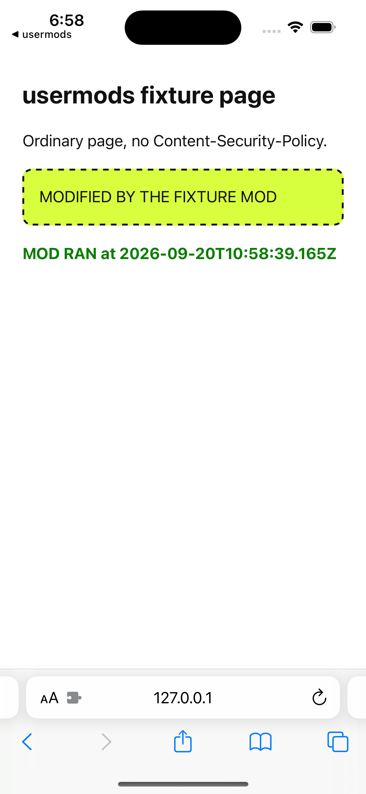
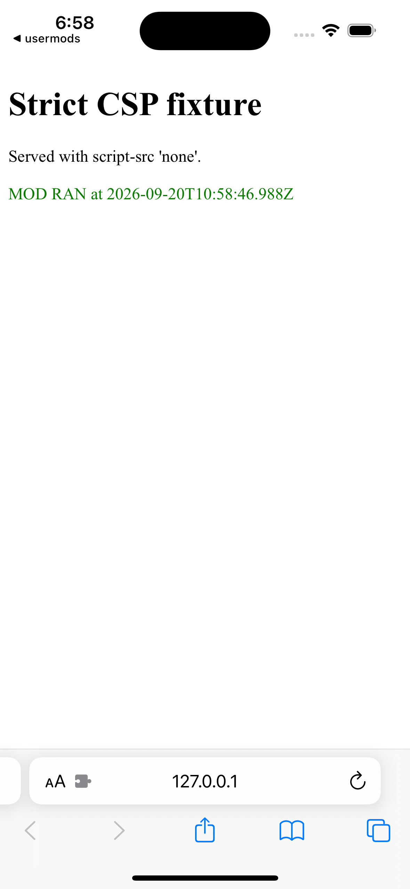
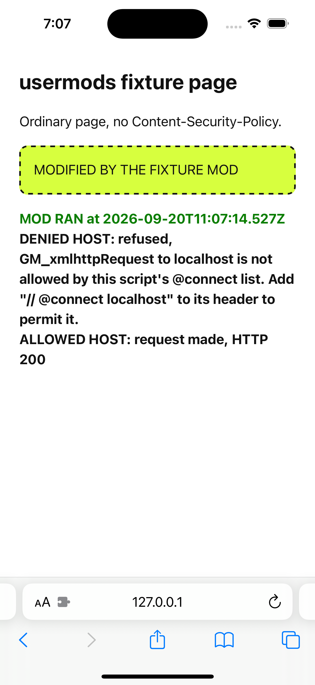
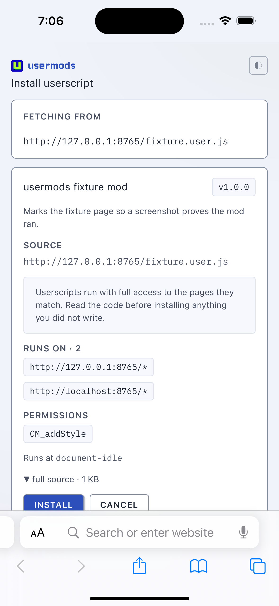
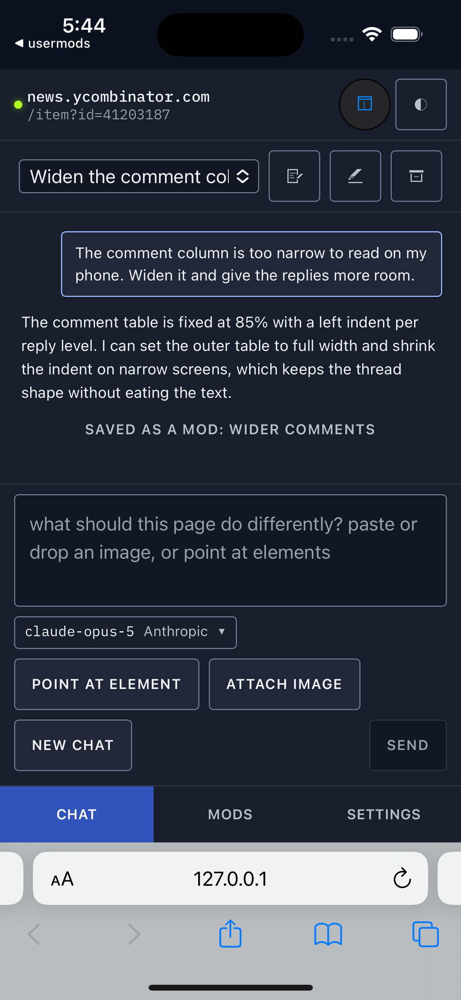
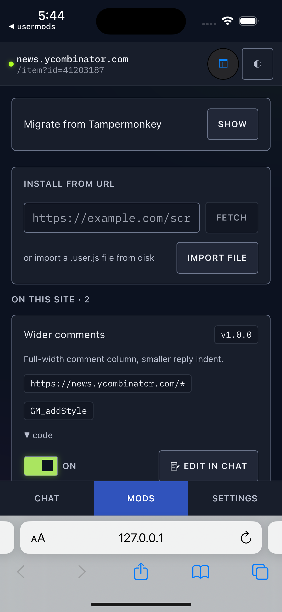
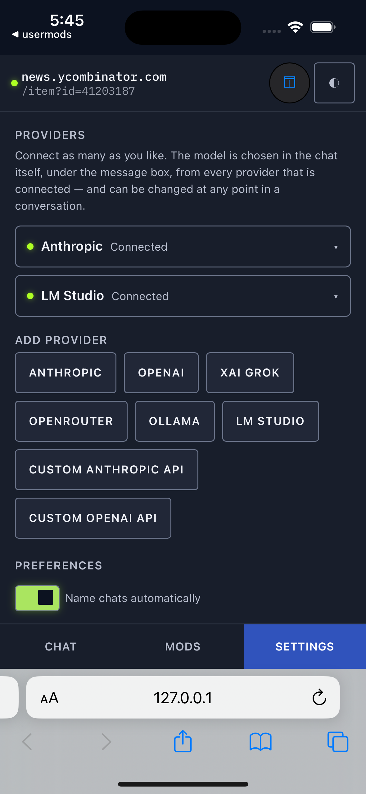
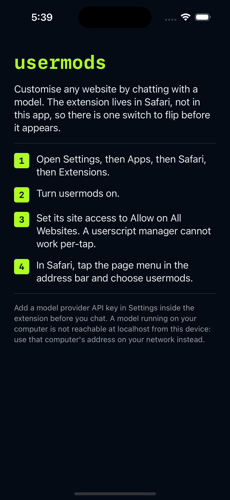

# Safari: iOS and macOS

One app and one extension, built from one pair of Xcode targets for both platforms. This page covers
what the Safari build does differently, what its isolation guarantees actually are, what it cannot
do, how to build and install it on each platform, and what was watched happening against what was
not.

On iOS it has been built, installed, enabled and seen running saved mods in Mobile Safari on the
iPhone 15 simulator (iOS 17.5). No physical iPhone or iPad has run it.

On macOS it has been built, signed, sandboxed and launched, and its popup document has been laid out
by the real Safari on a Mac. It has **not** been seen running as a loaded Safari extension, because
a locally signed extension stays out of Safari's list until two Safari-wide developer settings are
turned on by hand. [What was verified](#what-was-verified-and-how) draws both lines row by row.

Read [docs/browsers.md](browsers.md) first if you want the API-by-API research this port came out of.
That page is the survey; this one is the implementation.

## The short version

Safari has no `chrome.userScripts`, no `runtime.onUserScriptMessage` and no `sidePanel`. Those three
absences are the whole port:

| Chrome and Firefox | Safari |
|---|---|
| `userScripts.register()` per saved mod | one declared content script that asks the background what to run |
| `userScripts.execute()` for Try | a message to that content script |
| `runtime.onUserScriptMessage` for GM calls | `runtime.onMessage` plus a capability token |
| a port per mod for GM value changes | one port per document, delivered only to the mod that owns the change |
| side panel | toolbar popup: the whole screen on iPhone, a small window on a Mac |

Everything above the execution layer is the same code: the React views, the agent loop, the provider
adapters, mod header parsing, the GM API surface, Tampermonkey import. The Chrome build is unchanged,
including a byte-identical `manifest.json`.

## Two engines, one adapter

`lib/exec/engine.ts` picks an engine from what the runtime exposes, not from a build flag:

- `'user-scripts'` on Chrome and Firefox. What shipped, untouched.
- `'content-script'` on Safari. `entrypoints/modrunner.content.ts` is declared on `<all_urls>` at
  `document_start` in all frames. At start it asks the background which mods belong to this document.
  The background answers with code already built and already bound to that frame, and the runner
  holds each mod back to its own `@run-at`.

`lib/exec/adapter.ts` is the one interface the background talks to, so the Safari path is a real
second implementation rather than a shim pretending to be the first.

`scripting.executeScript` is not the Safari primitive, deliberately. It takes `files` or a serialized
`func`, never a code string, so it cannot run source a model just wrote. The `func` form still has to
`new Function(src)` at the far end, which lands in the same place as the content script with an extra
hop. Its one job stays what it always was: injecting the extension's own bundled content script by
file path, into tabs that were already open when the extension was enabled.

Where Chrome registers ahead of time and lets the browser match, Safari matches at claim time
(`lib/exec/plan.ts`, using the same `modMatchesUrl` predicate the Mods list uses, so what the list
says runs on a page and what runs on it cannot drift apart). A mod is built, and its GM values
snapshotted, at the moment a page asks for it, which is strictly fresher than Chrome's
snapshot-at-registration.

### Timing

Safari documents `injectImmediately` as effectively always immediate, so run-at cannot be delegated
to the browser. The runner lands at `document_start` and waits itself:

| `@run-at` | when the runner evaluates |
|---|---|
| `document_start` | immediately |
| `document_end` | `DOMContentLoaded` |
| `document_idle` | after `load`, plus a turn |

A claim answered after the page already finished loading still runs its mods rather than waiting for
events that have fired.

### Running exactly once

A document can get both the declared content script and a manual injection. Running a mod twice
would be worse than not running it, so there are two independent guards: a flag on the isolated
world's own `window` stops a second copy of the runner, and the background's ledger
(`lib/exec/plan.ts`) covers the other direction, where a suspended worker makes the runner retry a
claim it already made.

Safari stops the background worker aggressively. The claim is retried with backoff, and the port is
reconnected lazily rather than held open.

## What the isolation actually is

Two separate mechanisms, and it matters which one is load bearing.

**The capability grant is the boundary.** On Chrome, a GM message arriving on
`runtime.onUserScriptMessage` could only have come from registered mod code, so the `modId` it
carried was as trustworthy as the channel. On Safari the runner is an ordinary content script, so its
GM traffic shares `runtime.onMessage` with the popup, the dashboard and the page content script. A
self-declared `modId` on that channel would be a claim, not a fact, and GM calls are not harmless:
`gm.xhr` makes a request with the extension's origin and some mod's `@connect` allowlist, and
`gm.setValue` writes into some mod's storage.

So `modId` stops travelling in the message. `lib/exec/protocol.ts` has no such field. The background
mints a grant before it hands code over and the runner echoes back only an opaque token; the
background looks the token up and derives the mod from its own table (`lib/exec/grants.ts`). What
that buys, each case asserted in `test/exec-grants.test.ts`:

- **No forged identity.** A message claiming `modId: 'other'` cannot become mod `other`. The modId is
  whatever the token was issued for.
- **No cross-mod leakage.** Mod A's token yields mod A's storage and mod A's `@connect` list. Two
  mods in one document hold two different tokens.
- **No unauthorized network or storage calls.** `GM_CALLS` in `lib/exec/protocol.ts` is an allowlist.
  An unrecognised call type is refused and an unrecognised field is dropped, rather than being passed
  through to a handler that might understand it.
- **No hostile-page access.** A page cannot send extension messages at all without a content script
  doing it for them, and a token presented from another frame fails: `resolve()` compares the
  sender's tab and frame, both supplied by the browser rather than by the message.
- **No replay after the document is gone.** Navigation and tab close revoke. A grant also expires on
  its own after 30 minutes, so a missed revoke (a worker suspended when the tab closed) has a bounded
  cost.
- **No privilege after disabling.** Turning a mod off revokes every live grant it holds. Already
  running code cannot be unrun, but it stops being able to call back.

**Shadowing `chrome` is hardening, not the boundary.** `evaluateIsolated` binds `chrome` and
`browser` as parameters set to undefined, so a mod's own scope cannot reach the extension API by
name. An isolated world still has `window.chrome`, so this raises the cost of an accident rather than
closing a hole. The grant is what holds.

**MAIN-world code gets no grant at all.** `GrantTable.issue()` returns null for `world: 'MAIN'`.
Page-world code lives where the page can read the script text it came from, so a token handed there
is a token the page has. Chrome's MAIN world has no GM messaging either, so this is the existing
contract enforced, not a Safari-only restriction.

## Limitations

These are real and none of them have a workaround in this build.

**A page's CSP can block `@grant none` mods.** A mod that asks for the page world
(`Mod.world === 'MAIN'`, what `@grant none` and `unsafeWindow` mean) runs as an inline `<script>`,
because reaching page globals is the entire point. A site with a strict `script-src` refuses that,
and usermods does not rewrite any site's CSP to get around it, globally or per request. Chrome's
`userScripts` isolated world sidesteps page CSP; Safari has no equivalent, so on Safari this class of
mod fails on CSP-strict sites.

What it does instead is notice. A blocked inline script does not throw and does not report: the
element is appended, nothing runs, and the only signal is a `securitypolicyviolation` event on a
later task. Waiting for that would report the failure after the page moved on, so the injected source
sets a one-shot attribute on `<html>` as its first statement and the runner checks for it
synchronously right after append. Attribute present means the script ran. Absent means the page
refused it, and the mod is reported blocked rather than silently skipped. Isolated-world mods (the
default) are unaffected.

**Safari ignores the install redirect rule.** Chrome and Firefox catch a `.user.js` navigation with a
`declarativeNetRequest` redirect, before the page is fetched. iOS Safari 17.5 stores that rule, keeps
it in the extension's own rule database, records no error against it, and renders the raw script text
anyway. Safari builds fall back to watching navigations through the tabs API
(`watchUserJsNavigations` in `entrypoints/background.ts`), which reaches the same install page. It
works and it is late: the navigation is already under way, so script source can flash up before the
install page replaces it.

**No sidebar.** Safari has no side-panel surface for extensions. The popup is the only UI, which on
iPhone means a sheet covering the page it is about. That is why the popup header names the target tab
at all times (`lib/mobile.ts`, `targetChip`): once the popup is open there is nothing else on screen
to tell you which tab you opened it from, and "Try this mod" against the wrong tab is a confusing
failure rather than an obvious one.

**API-key providers only.** `lib/buildflags.ts` turns subscription sign-in off in the Safari build.
The ChatGPT and SuperGrok flows are device-code flows against endpoints the vendors do not document,
and neither has been exercised on Safari or iOS. A sign-in button that has never run on the platform
it is on would be worse than saying so. Settings explains it in place.

**`localhost` means the phone.** On a desktop, "run a model locally" and "point usermods at
localhost" are the same sentence. On iOS the extension runs inside Safari on the phone, so
`localhost` is the phone, and the model on the laptop across the room is not reachable by that name.
The provider field says this next to itself rather than leaving it to be discovered.

**The extension has to be enabled by hand.** No app can deep link into the relevant Settings pane, so
the host app's one screen says where the switch is. See [Install](#install).

**The host app has no home-screen icon.** It ships with the system placeholder. `assets/icon.svg`
renders fine at 1024 through the same path as the toolbar icons; the blocker is that an iOS
home-screen icon has to come from a compiled asset catalog, and `actool` on the toolchain this was
built with (Xcode 15.4 on macOS 26) fails with "Failed to launch AssetCatalogSimulatorAgent via
CoreSimulator spawn" on every attempt, which fails the whole `xcodebuild`. Rather than commit a
catalog that breaks the build on the machine the build was verified on, there is no catalog. Whoever
next builds this on a matched Xcode and macOS pair can add one in a few minutes.

## Manifest differences

`lib/manifest.ts` holds them as a pure function and `test/manifest.test.ts` pins the shape. A
manifest mistake does not show up as a stack trace: the wrong permission on Safari is a load-time
refusal.

| key | Chrome | Safari |
|---|---|---|
| `permissions` | `sidePanel, storage, scripting, tabs, userScripts, declarativeNetRequest` | `storage, scripting, tabs, declarativeNetRequest` |
| `action.default_popup` | absent (the click opens the side panel) | `popup.html` |
| `minimum_chrome_version` | `135` | absent |
| `browser_specific_settings.safari.strict_min_version` | absent | `16.4` |
| `content_scripts` | the page content script | plus `modrunner.js`, all frames, `document_start` |

`userScripts` and `sidePanel` are dropped rather than left in and ignored, because asking for a
permission the browser has never heard of is not harmless there. 16.4 is set by the newest API the
extension actually calls: `scripting.executeScript` and
`declarativeNetRequest.updateDynamicRules` both land at 15.4, but an MV3 background in Safari is a
service worker, and that is 16.4 (iOS 16.4 shipped March 2023).

Because Safari sets `default_popup`, `action.onClicked` never fires there, which is why
`entrypoints/background.ts` guards that handler rather than assuming the click is its to handle.

## The popup UI

The popup and the side panel share every view and all the provider logic. `App.tsx` takes a
`surface` prop (`'panel' | 'popup'`) and wears a different shell for each, because the difference
between a tall column beside a visible page driven by a mouse and a full-screen sheet driven by a
thumb is real enough that faking one with the other would be worse than having two.

The popup itself then has two shapes, because a phone sheet and a Mac popover are not the same
object either. They are one shell with a `data-layout` attribute rather than a third surface, since
what differs is sizes and where the navigation sits, not what is on screen.

| | compact | roomy |
|---|---|---|
| where | iPhone, iPad | Mac |
| navigation | across the bottom, 48px rows | under the header, 34px rows |
| controls | 44px, switch 48x28 | the panel's own sizes, switch 32x18 |
| fields | 16px minimum, which is what stops iOS zooming on focus | the panel's sizes |
| document | `100dvh`, safe-area insets, keyboard inset measured | a fixed 420x560 window |
| header actions | icons, labels hidden | icons with their labels |

`popupLayout()` in `lib/mobile.ts` picks between them from `(pointer: coarse)` and the width, and
`usePointerEnvironment()` in `entrypoints/sidepanel/usePointer.ts` keeps that current as the window
changes. Not the user agent: an iPad with a trackpad attached still reports a coarse primary pointer
and still wants the big targets, and a user-agent test would get that backwards. The width is a
floor, not a signal, so a popover too narrow for a header and three tabs falls back to compact
rather than overflowing.

The navigation moves in the DOM rather than with CSS `order`, so tabbing through the popup follows
what is on screen.

What the popup shell does that the panel does not:

- **Navigation of its own.** Three destinations, labelled in text. On a phone they are full-width
  rows in the only part of the screen a thumb reaches without a grip change, and everything that is
  not one of the three views sits in the header, out of thumb reach.
- **Target tab identity in the header,** always, with the path and a live dot. It says why rather than
  going blank when there is no page it can act on, for example on a `chrome:` or extension page.
- **Keyboard handling,** on the phone only. iOS shrinks `window.visualViewport` instead of resizing the window, so a
  composer pinned to the bottom of `100dvh` ends up under the keyboard. `keyboardInset()` in
  `lib/mobile.ts` measures the covered strip, subtracting `offsetTop` because iOS also scrolls within
  the visual viewport, and the popup pads it off the bottom. A Mac popup is a fixed window with no
  on-screen keyboard, so the listener is not attached there at all. Cases in `test/mobile.test.ts`.
- **Safe areas.** `env(safe-area-inset-*)` on the header and the navigation, so neither lands under
  the notch or the home indicator.
- **Touch targets.** On a phone, buttons, selects and the mod on/off switch are grown to at least
  44px. Every one of those rules is scoped to `[data-layout='compact']`, so the Mac popup keeps the
  sizes the views were drawn with. `test/popupshell.test.ts` fails if a thumb-sized rule is written
  without that scope, which is the mistake that renders fine and looks like a shrunken phone.
- **Chats survive dismissal.** Chats, messages and items already live in `storage.local`
  (`lib/chats.ts`), not in the popup, so a popup the system tears down comes back to the same
  transcript. Dismissal is not a state change.

## Install

Requirements: a full Xcode (not just Command Line Tools), node and npm. The scripts never run
`sudo xcode-select --switch`. They find a full Xcode and pass it to their own child processes as
`DEVELOPER_DIR`, which is scoped to that process and gone when it exits, so your machine's
`xcode-select -p` is left alone.

```sh
npm install
node scripts/safari-xcode.mjs doctor      # what is installed, and what that allows
node scripts/safari-xcode.mjs simulator   # iOS: build, boot a simulator, install, launch
node scripts/safari-xcode.mjs mac         # macOS: build the app with the extension inside it
```

`doctor` prints the toolchain it found and what it can do with it. `simulator` defaults to an iPhone
15; pass `--device 'iPhone 15 Pro'` for another. `mac` builds for the macOS SDK and prints where the
app landed, what the extension was signed with, and what Safari still wants. The other commands:

```sh
node scripts/safari-xcode.mjs stage    # npm run build:safari, then copy the output into safari/
node scripts/safari-xcode.mjs build    # stage, then xcodebuild for the simulator SDK
node scripts/safari-xcode.mjs build --sdk iphoneos --team ABCDE12345 --bundle-id com.you.usermods
node scripts/safari-xcode.mjs mac --team ABCDE12345 --launch
```

### One pair of targets, two platforms

There is one app target and one extension target, and they build for both platforms. `SDKROOT = auto`
in `safari/Config/Shared.xcconfig` lets the build pick its SDK from whatever `-sdk` or `-destination`
it was given, `SUPPORTED_PLATFORMS` lists what it may pick, and the few settings that genuinely
differ are written with an `[sdk=macosx*]` or `[sdk=iphone*]` condition next to the shared value. The
alternative, a second pair of targets, would double a hand-written project file and every setting in
it for two files of AppKit code.

The same split runs through the sources: `App/AppDelegate.swift` and `App/ViewController.swift` are
wrapped in `#if os(iOS)`, `App/MacAppDelegate.swift` and `App/MacViewController.swift` in
`#if os(macOS)`, so each SDK compiles exactly one entry point. The extension's `Info.plist` is shared
without change, because `NSExtensionPointIdentifier = com.apple.Safari.web-extension` means the same
thing to WebKit on both. Only the entitlements differ, because only macOS has a sandbox to declare.
`test/safari-mac.test.ts` asserts each of those lines, since all of them fail quietly: a missing
`NSPrincipalClass` launches a Mac app that draws nothing and reports no error.

`stage` exists because the web resources come out of `wxt build -b safari` with content hashes in
their file names, which Xcode cannot list in a Copy Bundle Resources phase. They are staged into
`safari/Extension/Resources` (gitignored, build output) and copied into the `.appex` by a shell phase
that fails loudly when the stage step has not been run. Skipping it would otherwise produce an app
whose extension never appears in Safari, with no error anywhere.

For a real device, override the bundle identifier and pass your team: two apps cannot share a bundle
identifier under one Apple ID, and a device build has to be signed. You can also open
`safari/usermods.xcodeproj` in Xcode and press run; run `stage` first.

### Then turn it on, on iOS

Installing the app is not enough. On the simulator or the device:

1. Open the usermods app once. It tells you where the switch is.
2. **Settings > Apps > Safari > Extensions > usermods**, and turn it on. On iOS 17 and earlier the
   path is **Settings > Safari > Extensions**.
3. Allow it on the sites you want. "All Websites > Allow" is the usual answer, since a mod can match
   any host.
4. In Safari, tap the page-settings button in the address bar, then usermods.
5. Open Settings inside the popup and add a provider API key.

### Then turn it on, on macOS

Safari finds the extension through the app, so the app has to live somewhere permanent. A build
directory is not that.

1. `cp -R .output/safari-xcode/Build/Products/Debug/usermods.app /Applications/`
2. Open it once. The window says where the switch is and can open Safari's extension settings for
   you, which is a deep link macOS has and iOS does not.
3. **Safari > Settings > Extensions > usermods**, and turn it on.
4. Give it **Every Website > Always Allow**. Enabled with no allowed sites loads the extension and
   injects nothing, which looks exactly like a broken build.
5. Click usermods in Safari's toolbar, then open Settings inside the popup and add a provider.

**A locally signed build needs two Safari settings first.** Without a Developer ID certificate,
`xcodebuild` signs ad hoc, and Safari does not list an ad-hoc signed extension at all: step 3 shows
an empty list rather than an error. Two Safari-wide developer settings reveal it:

1. **Safari > Settings > Advanced > Show features for web developers**
2. **Develop > Allow unsigned extensions**, which resets every time Safari quits

Both change how Safari treats every extension you have, not just this one, so no script in this
repository turns them on. `node scripts/safari-xcode.mjs mac` prints them and stops there. A
Developer ID signature removes the requirement, which is why `--team` exists.

Ad-hoc is also why the Mac build cannot simply skip signing the way a simulator build can:
entitlements are applied at signing, so an unsigned app is an unsandboxed one, and Safari will not
load an extension out of it.

**The signature is taken after the last step that writes into the bundle.** Xcode re-signs a target
when that target's own inputs change. The phase that copies the built web extension into the `.appex`
is not one of them, so a build where only the web side changed copies the new files in and skips the
signature: the build log carries no CodeSign line for the extension at all. The bundle is then sealed
against the files it held one build ago, and `codesign --verify --deep --strict` on the app fails
with "a sealed resource is missing or invalid" in the extension. Nothing in the build output says so,
and the app around it verifies fine, because the app really was signed after the extension was
embedded in it.

So `safari-xcode.mjs mac` signs both bundles itself once `xcodebuild` returns, extension first
because signing it invalidates the app's seal over it, and then verifies the result. It reads the
identity, the entitlements and the hardened runtime flag off the bundle rather than out of the
repository: a Debug build carries `get-task-allow`, which no `.entitlements` file here mentions, and
signing from those files would quietly drop it. If verification fails the command fails, rather than
printing "built". The staging phase also removes what the previous build staged before copying, so a
chunk whose content hash changed does not leave its older twin behind inside the bundle.

## Screenshots

iPhone 15 (iOS 17.5) in the simulator, throughout.

### The extension running

The installed app extension, enabled in Safari, running mods held in its own `storage.local`.

| | |
|---|---|
|  |  |
| **A saved mod running.** Read from the extension's storage, matched by the background, evaluated by the runner in the page. `GM_addStyle` painted the dashed box and the mod wrote the timestamp at `document-idle`. | **Under `script-src 'none'`.** The mod's logic still runs, because an isolated world is not the page's script context. `default-src 'self'` blocks every inline style, the page's own and `GM_addStyle`'s alike, which is the site's policy holding rather than being rewritten. |
|  |  |
| **`@connect` enforced on iOS.** The allowed host got its request: HTTP 200 in the page and a matching line in the fixture server's log. The denied host got the refusal, and the server log has no line for it, so nothing left the device. | **The install page,** at the extension's own origin, reached by opening a `.user.js` link. The preview is the fetched script: name, version, match patterns, GM grants, run-at, full source, INSTALL and CANCEL. |

### The popup, as layout only

The three popup views below are the built popup document served over HTTP and loaded in Mobile
Safari with the extension APIs stubbed (`scripts/safari-preview.mjs`, which says so in its header).
That is layout and interaction evidence on real WebKit. It is not the extension's own popup, for the
reason in [the gaps](#the-gaps-and-why).

| | |
|---|---|
|  |  |
| **Chat.** The target tab is named in the header at all times, because the popup covers the page it acts on. Bottom navigation, three destinations, thumb reach. | **Mods.** Install from a URL or a file, then the mods that match this site. Each card carries its match pattern and GM grants, and the on/off switch is 48x28 inside a 44px label. |
|  |  |
| **Settings.** Connected providers, then the presets you can add, all of them API-key providers in this build. The address bar showing 127.0.0.1 is the preview route, not the extension. | **The host app.** One screen, whose only job is to say where the switch is, because no app can deep link into that Settings pane. |

### No macOS screenshots

There are none, and the reason is the machine rather than the build. Taking a screenshot on macOS
needs Screen Recording permission, which the shell this was built from does not have:
`screencapture` fails with "could not create image from display". Granting it is a system privacy
setting, and changing one of those on someone's Mac to make a nicer document is not a trade worth
making.

What stands in for them is text that came out of the same windows: the host app's accessibility tree
read back after launch, and the popup's own report of the layout it produced in Safari 26.6.2, which
`scripts/safari-preview.mjs --probe` prints. Both are in the table below. On a Mac with that
permission, `node scripts/safari-preview.mjs --webkit-shots out/` renders both popup layouts in
Playwright's WebKit and checks each one drew the layout its size is supposed to get.

## What was verified, and how

Tiers kept apart on purpose. Emulating a phone viewport in Chromium is not Safari validation, and a
preview page with stubbed extension APIs is not the extension running.

| Tier | What ran | Result |
|---|---|---|
| Automated, node | `npm test`, including `test/exec-engine`, `exec-plan`, `exec-protocol`, `exec-grants`, `exec-evaluate`, `exec-wrap`, `exec-adapter`, `gm-bridge`, `manifest`, `mobile`, `popupshell`, `safari-mac` | pass, 829 tests |
| Automated, types | `npx tsc --noEmit` | pass |
| Chromium build | `npm run build`, manifest compared byte for byte against the shipped one | unchanged |
| Safari build | `npm run build:safari` | pass, MV3 manifest as pinned |
| Native build, iOS | `node scripts/safari-xcode.mjs build` on Xcode 15.4, simulator SDK | `** BUILD SUCCEEDED **` |
| Native build, macOS | `node scripts/safari-xcode.mjs mac` on Xcode 15.4, macOS SDK 14.5 | `** BUILD SUCCEEDED **`, `usermods.app` with `Contents/PlugIns/usermods-extension.appex` inside it |
| iOS simulator, install | installed and launched on iPhone 15 (iOS 17.5); `pluginkit -m -v -p com.apple.Safari.web-extension` lists `io.github.kballenegger.usermods.extension(0.1.0)`; `Library/Safari/WebExtensions/Extensions.plist` records it with `AccessibleOrigins: ["<all_urls>"]` and `Permissions: [storage, tabs, scripting, declarativeNetRequest]` | pass, nothing in the manifest refused |
| iOS simulator, execution | the matrix below | pass, with the gaps named below |
| Mobile Safari layout | the built popup served over HTTP with stubbed extension APIs (`scripts/safari-preview.mjs`) | pass, layout only |
| macOS signature | `codesign --verify --deep --strict` on the built app, which `safari-xcode.mjs mac` now runs itself | valid on disk, satisfies its designated requirement; extension `Signature=adhoc`, `flags=0x10002(adhoc,runtime)`, `TeamIdentifier=not set` |
| macOS signature, after a web-only change | changed a popup stylesheet, rebuilt, verified again | pass. The same sequence before this branch's fix failed with "a sealed resource is missing or invalid" |
| macOS bundle contents | the `.appex` resource list compared against the staged build output | identical, 36 files, no stale content-hashed chunks left over |
| macOS entitlements | `codesign -d --entitlements` on both bundles | app: `app-sandbox`; extension: `app-sandbox` and `network.client` |
| macOS host app | launched, window drawn, accessibility tree read back | the four enabling steps, both notes and the settings button all present |
| macOS deep link | clicked "Open Safari extension settings" | Safari opened its Extensions pane; the app's failure note stayed hidden |
| Desktop Safari layout | the built popup served over HTTP and opened in Safari 26.6.2, which reported back what it laid out (`scripts/safari-preview.mjs --probe`) | `coarsePointer: false`, `layout: "roomy"`, navigation above the body, switch 18px, so no phone rule leaked |
| macOS extension, loaded | not run | Safari lists no ad-hoc signed extension until two developer settings are on; see [the gaps](#the-gaps-and-why) |
| Real device | not run | no device authorized for this work |

### What was seen running in Mobile Safari

Every row is the installed extension on the iPhone 15 simulator, against pages from a local fixture
server. The mods were put into the extension's `storage.local` directly, by writing its backing
database inside the app container, because saving one through the UI needs a tap on INSTALL.
Everything after that is the product's own path: the background read them, matched them against the
document, minted a grant each and handed them to the runner.

| Check | What was seen | Result |
|---|---|---|
| A saved mod runs on a matching page | DOM text replaced and a `GM_addStyle` rule applied, with a timestamp the mod wrote itself (`ios-mod-running.png`) | pass |
| Reloading runs it again | a later timestamp on every load | pass |
| Two mods on one page | both ran in one document, each against its own grant | pass |
| Disabling a saved mod | `enabled: false`, reload, no marks on the page at all | pass |
| Re-enabling it | marks back, with a timestamp later than the disabled load | pass |
| A mod that throws | the throwing mod ran first; the other two mods on the page still finished | pass |
| Ordinary page, no CSP | isolated-world mod ran, styles applied | pass |
| Strict CSP, `default-src 'self'; script-src 'none'` | the mod ran, inline styles were blocked, and the page's policy was not touched (`ios-mod-strict-csp.png`) | pass |
| `@connect` allowed host | `GM_xmlhttpRequest` reached the server, HTTP 200 in the page and in the server log | pass |
| `@connect` denied host | refused with the reason string, and no request in the server log | pass |
| `.user.js` navigation | Safari showed raw script source: the redirect rule is stored, is error free, and does nothing. Fixed by the tabs-API fallback, after which the real install page renders at the extension's origin with the fetched preview (`ios-install-page.png`) | defect found, fixed, pass |
| The extension's own popup | not run, needs a tap on the toolbar | gap |
| The INSTALL button, and the target tab picker, dismissal and recovery | not run, all need a tap | gap |

### The gaps, and why

**Nothing can tap.** `simctl` boots a simulator, installs an app, opens a URL and takes a screenshot.
It has no tap. The GUI that would, Simulator.app, does not launch on the machine this was built on:
it dies in dyld looking for `_OBJC_CLASS_$__GCControllerManager`, an Xcode 15.4 against macOS 26
mismatch, before a window ever appears. So everything reachable by opening a URL was exercised, and
everything behind a finger was not: the toolbar popup, the INSTALL button, the target tab picker,
and dismissing the popup and coming back. Those paths have node tests and the HTTP preview behind
them, which is evidence about layout and logic, not about the extension's own popup. A person with a
device closes it in about two minutes: enable the extension, open a fixture page, tap the puzzle
piece.

**On macOS, Safari never listed the extension.** The app builds, signs, sandboxes, launches and
opens Safari's Extensions pane for you. That pane then shows its empty-state placeholder and no
usermods row, because the build is ad-hoc signed and Safari hides ad-hoc signed extensions until
**Show features for web developers** and **Develop > Allow unsigned extensions** are both on. Those
are settings about the whole browser, and turning them on for someone is not a build script's
decision, so this stops there and names them. Everything downstream of listing the extension is
therefore unverified on macOS: enabling it, granting origins, the toolbar popup as the extension's
own document, installing a mod, running one, GM grants, tab context and dismissal. What is verified
on the Mac is the build, the signature, the entitlements, the host app, the deep link, and the popup
document's layout in real Safari. A person with a Developer ID, or two minutes and those two
settings, closes the rest.

**Enabling on iOS was written, not tapped,** for the same tapping reason. Safari keeps extension state in the host
app's container, in `Library/Safari/WebExtensions/Extensions.plist`. The harness set `Enabled` there
along with `GrantedPermissions` and `GrantedPermissionOrigins`, which is what the "All Websites >
Allow" step writes. That pair is easy to miss and decides everything: enabled with no granted
origins, Safari loads the extension, applies its declarative rules, and injects no content script
anywhere, so no mod ever runs. Nothing in the extension was patched to reach that state, and the
build that ran is the committed one.

## Distribution

Nothing here is an App Store submission and nothing here is signed for release. On macOS that is the
difference between an extension Safari lists and one it hides: a Developer ID signature is what makes
the two developer settings in [Install](#then-turn-it-on-on-macos) unnecessary. Apple's App Review
guideline 2.5.2 covers executing code that changes an app's features, which is a fair description of
what usermods does with model-written scripts, so App Store distribution is an open question that
this port does not answer. See the Safari section of [docs/browsers.md](browsers.md). The device path in
[Install](#install) is written down but has not been run: nothing here is signed, and no physical
iPhone or iPad has run this build.
