# Screenshots

Every capture here is generated by `npm run screenshots`, which builds the extension, loads it into
Playwright's Chromium and drives the real side panel against a scripted mock backend — so these are
the running extension, not mockups. The README leads with a handful; this is the rest.

- [The panel](#the-panel)
- [Design](#design)
- [Light and dark](#light-and-dark)
- [iPhone and iPad](#iphone-and-ipad)

## The panel

<table>
  <tr>
    <td width="50%" valign="top">
      
      <b>Point at an element.</b> <b>+</b> → <i>Point at element</i>, then click one on the page: an <code>@reference</code> drops into your message, so you can say "this" and mean it.
    </td>
    <td width="50%" valign="top">
      
      <b>Migrating.</b> One Tampermonkey backup file brings the whole library across, on/off state and stored values included.
    </td>
  </tr>
  <tr>
    <td width="50%" valign="top">
      
      <b>Mods.</b> Saved scripts, split by whether they match the page you are on. Toggle, run, export or delete each one.
    </td>
    <td width="50%" valign="top">
      
      <b>Settings.</b> Every provider you have connected, each with its own key or sign-in and its own model list, and presets for adding another.
    </td>
  </tr>
  <tr>
    <td width="50%" valign="top">
      
      <b>Installing an outside script.</b> A <code>.user.js</code> link shows what it matches, what it is granted and what it loads, before anything is saved.
    </td>
    <td width="50%" valign="top">
      
      <b>Pick the model in the chat.</b> One chip in the chat bar holds every connected provider's models and the Thinking level. Change it mid-conversation and the next turn goes to the new one.
    </td>
  </tr>
  <tr>
    <td width="50%" valign="top">
      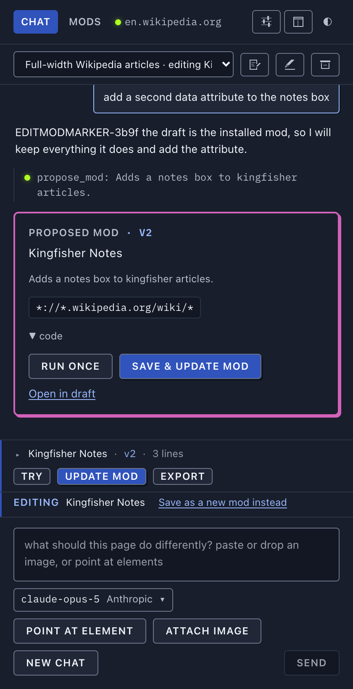
      <b>Editing an installed mod.</b> Any mod opens as the draft of a chat, and <i>Update mod</i> writes back over the same one.
    </td>
    <td width="50%" valign="top">
      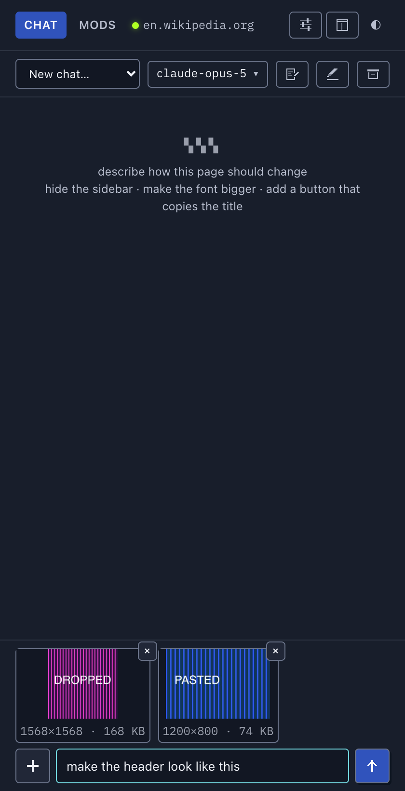
      <b>Attaching images.</b> Paste, drop or pick a screenshot or mockup; it is shrunk and re-encoded in the panel before it goes anywhere.
    </td>
  </tr>
  <tr>
    <td width="50%" valign="top">
      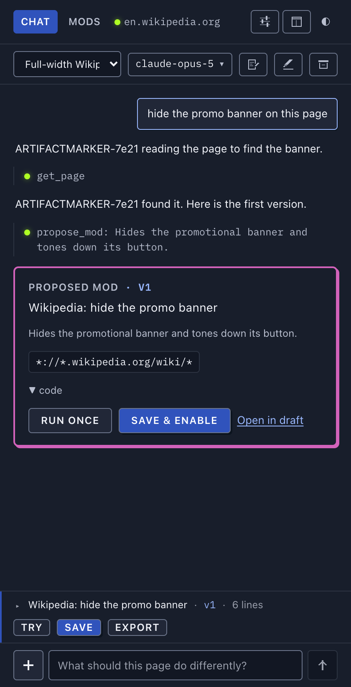
      <b>The draft.</b> One line above the composer — name, version, size, Try / Save / Export — expanding to the code, the version strip and the diff.
    </td>
    <td width="50%" valign="top">
      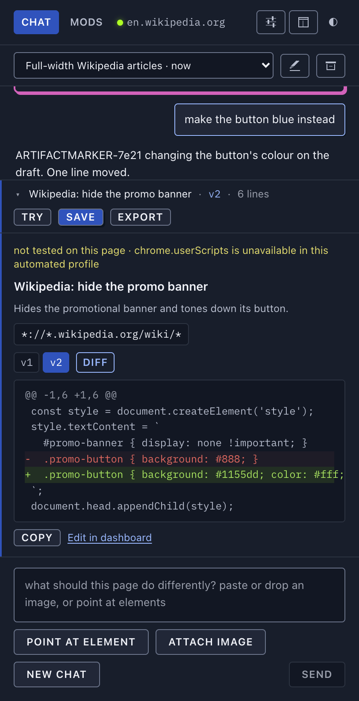
      <b>Versions and diffs.</b> Every accepted proposal is the next version of one draft, with a diff against the one before it and an undoable roll back.
    </td>
  </tr>
  <tr>
    <td width="50%" valign="top">
      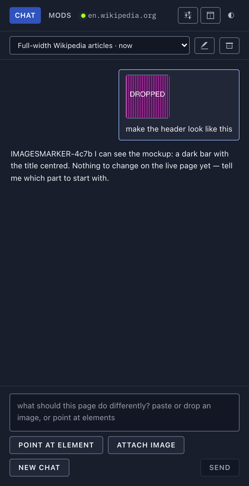
      <b>Sent attachments.</b> Thumbnails ride in the bubble; click one for the full-size view, Escape closes it.
    </td>
    <td width="50%" valign="top">
      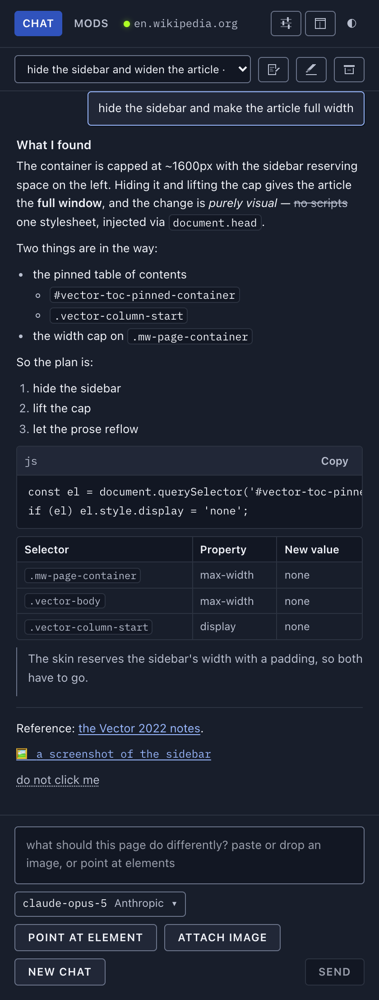
      <b>Replies are markdown.</b> Lists, tables, blockquotes and code blocks with a language label and Copy — sanitised, with no raw HTML reaching the DOM.
    </td>
  </tr>
  <tr>
    <td width="50%" valign="top">
      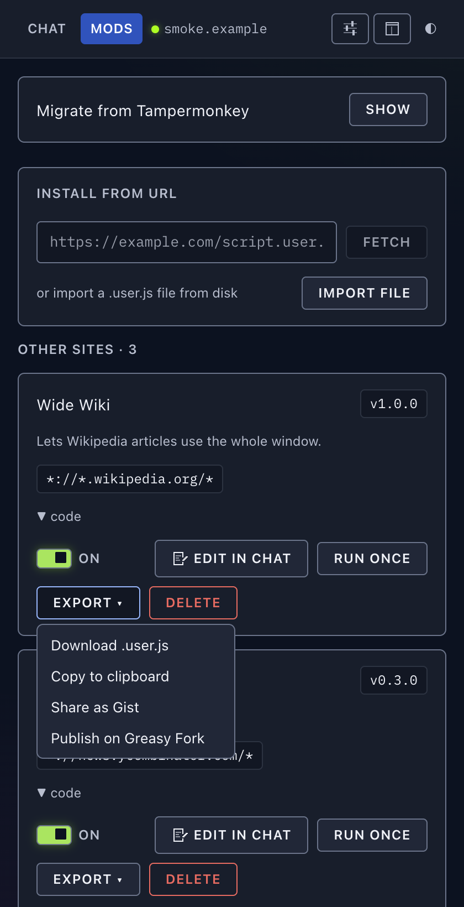
      <b>Export.</b> Download, copy, or share to a gist or Greasy Fork from your own signed-in tab.
    </td>
    <td width="50%" valign="top">
      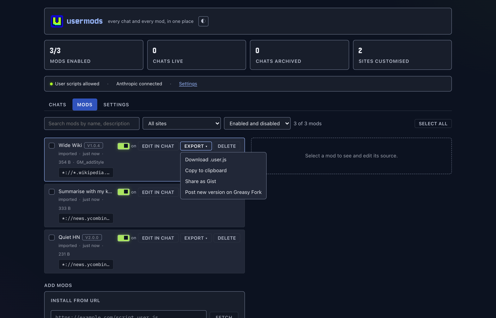
      <b>Export in the dashboard.</b> The same menu on every row; the items change once a mod has been shared.
    </td>
  </tr>
  <tr>
    <td width="50%" valign="top">
      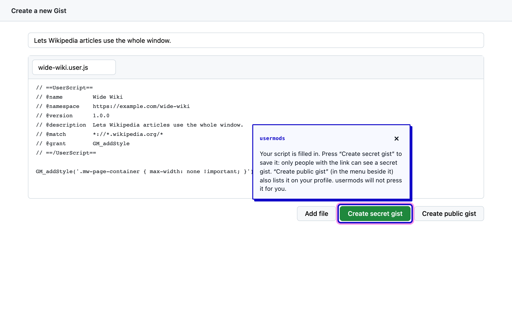
      <b>Sharing a gist.</b> usermods fills the form and points at the site's own button. You press it. (A reconstruction of the signed-in page; the smoke never touches GitHub.)
    </td>
    <td width="50%" valign="top">
      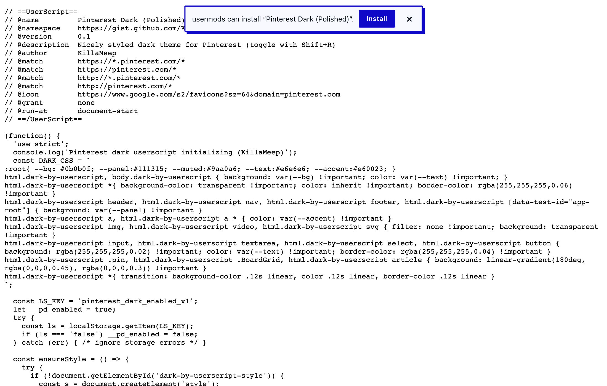
      <b>The install banner.</b> A page showing a userscript gets a dismissible offer to install it, through the usual preview.
    </td>
  </tr>
  <tr>
    <td width="50%" valign="top">
      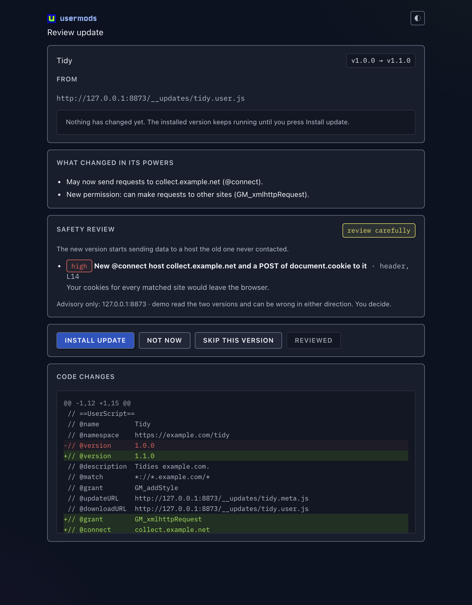
      <b>Reviewing an update.</b> What the new version may do that the old one could not, an optional safety review by your own model, and the diff. Nothing installs until you press Install update.
    </td>
    <td width="50%" valign="top"></td>
  </tr>
</table>

## Design

The interface is built on the banner, at the banner's hues rather than its saturation: a deep navy
page and panels on the electric blue's own hue, the blue itself for buttons, links and the active
tab, lime reserved for anything **alive**, pink for the hero card's edge and element chips, cyan for
focus. Anything you actually read — the transcript, code, the editor, settings help — sits on a solid
panel in a text face at a comfortable size, because the system's first principle is **calm, branded,
legible**.

> **Note.** This branch is **option B**, one of two design options open for comparison; neither is
> merged. Option A applies the same identity boldly — the electric blue as the page itself, bright
> 2px borders, hard offset shadows and pixel type throughout. The two are behaviour-identical.
> [§2 of the design doc](design.md#2-what-is-different-from-option-a-concretely) is a
> side-by-side.

**[design.md](design.md)** is the full style guide: the palette with hexes and OKLCH values
for both themes, the contrast table, typography, every component with its states and do/don'ts,
theming and the accessibility commitments. It embeds a living specimen rendered with the real
stylesheets, so it shows the system rather than describing it.

## Light and dark

The panel follows your OS by default, and the ◐ in the tab bar cycles Dark → Light → System from
anywhere. Day is its own design pass, not night inverted: the identity colours drop to the tones that
can carry text on white, the page is a cool white tinted on the same hue as night's navy, and every
glow turns off — there is no neon in daylight. Both themes meet WCAG AA and hold long-form reading
pairings to 7:1, which `test/contrast.test.ts` enforces against the token file.

<table>
  <tr>
    <td width="50%" valign="top">
      
      <b>Chat, day.</b>
    </td>
    <td width="50%" valign="top">
      
      <b>Chat, night.</b>
    </td>
  </tr>
  <tr>
    <td width="50%" valign="top">
      
      <b>Mods, light.</b>
    </td>
    <td width="50%" valign="top">
      
      <b>Mods, dark.</b>
    </td>
  </tr>
  <tr>
    <td width="50%" valign="top">
      
      <b>Settings, light.</b>
    </td>
    <td width="50%" valign="top">
      
      <b>Settings, dark.</b>
    </td>
  </tr>
  <tr>
    <td width="50%" valign="top">
      
      <b>Dashboard, light.</b> Every chat and every mod in a full tab — see <a href="guide.md#dashboard">Dashboard</a> in the guide.
    </td>
    <td width="50%" valign="top">
      
      <b>Dashboard, dark.</b>
    </td>
  </tr>
  <tr>
    <td width="50%" valign="top">
      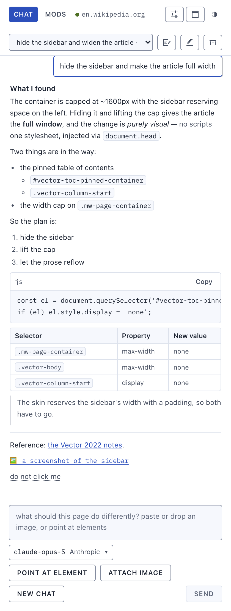
      <b>Markdown, light.</b>
    </td>
    <td width="50%" valign="top">
      
      <b>Markdown, dark.</b>
    </td>
  </tr>
</table>

## iPhone and iPad

The Safari build is a toolbar popup rather than a side panel: a small window with tabs under the
header on a Mac, and on iPhone and iPad a content-first chat with the chat list, the model, the
draft and navigation each one tap away in a bottom sheet. [safari.md](safari.md) has the build, the
limitations and what has actually been seen running.

<table>
  <tr>
    <td width="50%" valign="top">
      
      <b>Chat, iPhone.</b>
    </td>
    <td width="50%" valign="top">
      
      <b>Mods, iPhone.</b>
    </td>
  </tr>
  <tr>
    <td width="50%" valign="top">
      
      <b>Settings, iPhone.</b>
    </td>
    <td width="50%" valign="top">
      
      <b>A saved mod running in Mobile Safari.</b>
    </td>
  </tr>
  <tr>
    <td width="50%" valign="top">
      
      <b>The host app.</b> Where iOS sends you to turn the extension on.
    </td>
    <td width="50%" valign="top">
      
      <b>Installing a script on iPhone.</b> The same preview the desktop shows.
    </td>
  </tr>
  <tr>
    <td width="50%" valign="top">
      
      <b><code>@connect</code> refusal.</b> A request to a host the header never declared is refused and names the line that would permit it.
    </td>
    <td width="50%" valign="top">
      
      <b>Strict CSP.</b> One of the Safari limitations <a href="safari.md">safari.md</a> sets out.
    </td>
  </tr>
</table>
